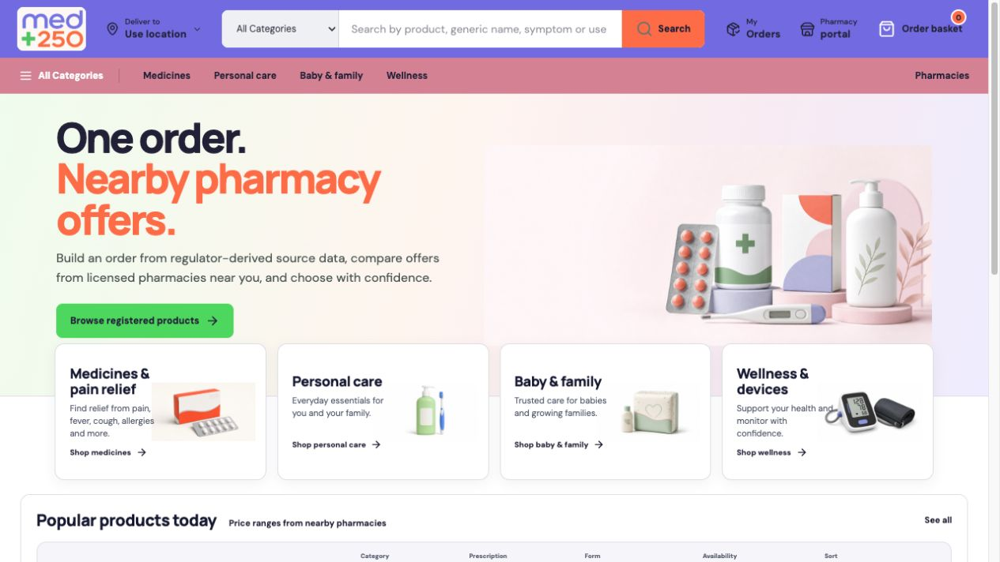
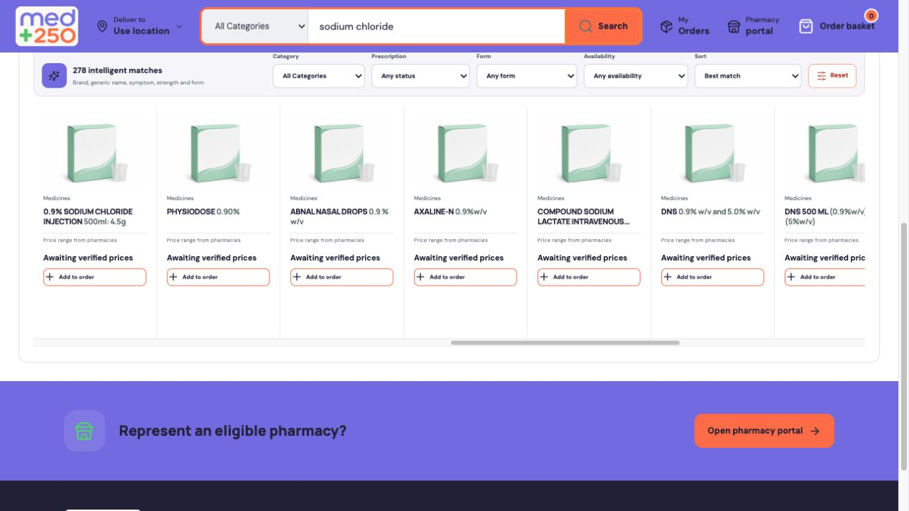
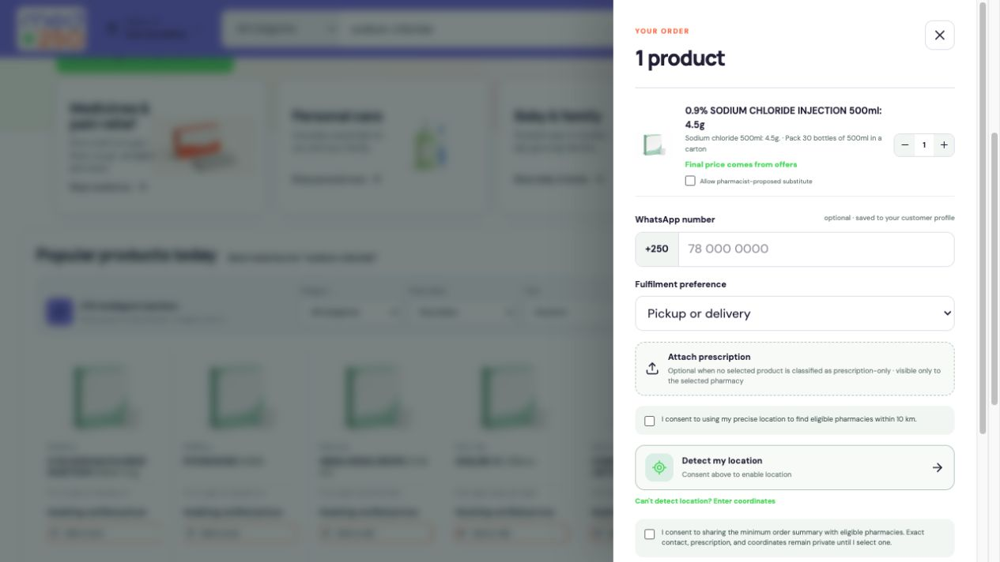
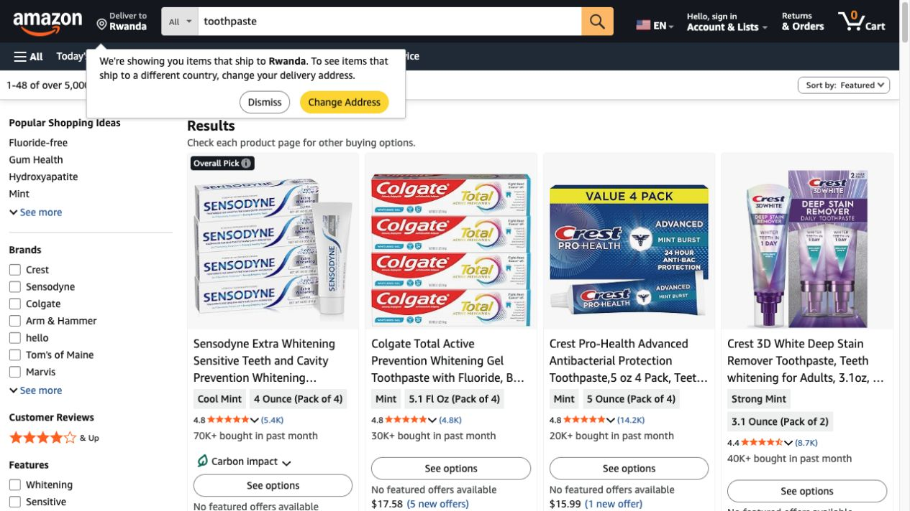

# MED+250 Amazon Alignment Audit — Corrected Marketplace Model

Date: 2026-07-13  
Scope: MED+250 compared with Amazon's product-discovery patterns, adjusted to MED+250's product-first and response-driven pharmacy model.

## Corrected Product Model

MED+250 is not a vendor-directory marketplace. Customers do not browse pharmacies, choose a pharmacy first, or need to know how many pharmacies are nearby.

The intended journey is:

1. Search or browse products.
2. Add products to one basket and keep shopping.
3. Open the basket.
4. Place the order.
5. MED+250 privately dispatches the order to eligible nearby pharmacies.
6. The customer sees only pharmacies that confirm the order.
7. Confirmed pharmacies are ranked by distance.
8. The customer chooses a responding pharmacy and either opens WhatsApp or launches MoMo USSD from the phone.

Pharmacies are inherently marketplace-approved. There should be no public verification labels, public pharmacy directory journey, or extra pharmacy-verification step.

## Corrected Verdict

**Overall score: 5.6 / 10 against the relevant parts of Amazon's marketplace bar.**

The score increases from the first audit because MED+250 should not be penalized for intentionally excluding vendor-first browsing, public pharmacy profiles, reviews, integrated payments, or a conventional checkout funnel.

Amazon remains the useful reference for product discovery, search accuracy, category navigation, product information, basket clarity, order status, and interaction reliability. It is not the reference for when pharmacies become visible or how payment must be processed.

## Corrected Scorecard

| Capability | Score | Assessment |
| --- | ---: | --- |
| Product-first marketplace model | 8.0 | The intended model is clear and appropriate for pharmacy demand matching. |
| Global navigation and product discovery | 6.5 | Familiar search-first structure with dedicated product categories. |
| Search relevance | 4.0 | Functional, but a specific query can still return hundreds of weakly explained matches. |
| Category integrity | 2.5 | Personal Care returned zero products without a useful empty state. |
| Product cards and catalogue clarity | 4.0 | Useful regulator-derived names, but imagery and structured product details remain weak. |
| Product-detail experience | 1.5 | No complete product-detail route comparable to Amazon's product pages. |
| Basket and simple order placement | 6.5 | The basket works, but order submission should become much simpler. |
| Private pharmacy dispatch | 6.0 | The concept is correct; the customer-facing waiting and response states need evidence. |
| Confirmed-pharmacy selection | 4.0 | Required model is clear, but the ranked responder screen was not available for testing. |
| WhatsApp and MoMo USSD handoff | 5.0 | Appropriate lightweight fulfilment model; the complete handoff was not tested. |
| Pharmacy portal access | 5.0 | Registered WhatsApp-number access is simple and aligned with the operating model. |
| Reliability and implementation hygiene | 7.0 | Build, lint, and 13 tests pass; one duplicate Supabase auth-client warning remains. |

## Corrected Audited Journey

1. **Browse/search products — promising.** The site is visibly product-led, but search precision and category data need improvement.
2. **Add products — healthy foundation.** Customers can add products and continue shopping.
3. **View basket — functional but too dense.** The basket contains the necessary order information but front-loads too many fields and consent decisions.
4. **Place order — needs simplification.** This should be one primary action after the basket is ready, not a staged checkout funnel.
5. **Private dispatch — correct model, unverified state.** Nearby pharmacies are an internal routing mechanism and should remain invisible until they respond.
6. **Await confirmations — missing customer state.** The order page needs a clear waiting state and live updates when pharmacies respond.
7. **Choose confirmed pharmacy — missing tested screen.** Only responding pharmacies should appear, ranked by distance.
8. **Contact or pay — correct lightweight handoff.** WhatsApp opens the selected pharmacy chat; MoMo opens the phone's USSD/tel dialer. No payment integration is required.

## Visual Evidence

### MED+250 product-first home

### MED+250 product search

### MED+250 basket

### Amazon product-discovery reference

## Findings That Remain Valid

1. MED+250 successfully communicates a product-first pharmacy marketplace.
2. Search is appropriately the dominant action.
3. Users can add multiple products to one basket and continue shopping.
4. Location belongs to the private dispatch mechanism, not public pharmacy discovery.
5. Category integrity is unreliable; Personal Care returned zero products without a useful explanation.
6. Search relevance needs work; “sodium chloride” returned 278 matches.
7. Search results do not explain exact, generic, strength, form, or synonym matches.
8. A sideways product rail is less scalable than a responsive results grid/list.
9. Product imagery is generic and repeated.
10. Product names, strengths, dosage forms, pack sizes, manufacturers, and prescription status need clearer structure.
11. MED+250 needs dedicated product-detail pages.
12. Product cards may show the overall contributed price range, but should not expose pharmacies before an order receives responses.
13. The basket is too dense for the intended simple-order flow.
14. Location should be requested only when needed to place the order and dispatch it.
15. Prescription attachment should appear conditionally only when the basket requires it.
16. The user needs a clear “Order placed—waiting for pharmacy confirmations” state.
17. Only responding pharmacies should become visible.
18. Confirmed pharmacies should be ranked by distance, without exposing non-responding pharmacies.
19. Each confirmed response should show enough information to choose: pharmacy name, distance, confirmed availability, price and fulfilment method.
20. The customer does not need public pharmacy profiles, verification badges, vendor browsing, or nearby-pharmacy counts.
21. WhatsApp should open only for the pharmacy selected from confirmed responses.
22. MoMo should use a simple USSD/tel launcher; no payment processor, receipt engine, reconciliation, refund, or failure-recovery integration is currently required.
23. The order page needs live response updates and a clear no-response/expired-order state.
24. Pharmacy WhatsApp OTP access is aligned with the model.
25. The authenticated pharmacy response workflow was not available for testing.
26. Empty, loading, dispatching, waiting, confirmed, no-response and expired states need explicit designs.
27. Mobile behavior is particularly important because WhatsApp and MoMo USSD handoffs are phone-based.
28. Keyboard, screen-reader, performance and device testing remain outstanding.
29. Search and order observability should measure product discovery, basket completion, pharmacy response and customer selection—not vendor-page engagement.
30. The duplicate Supabase auth-client warning should be resolved.

## Revised Action Plan

### Phase 1 — Product discovery and catalogue quality

1. Repair category mappings and add automated catalogue-quality checks.
2. Replace blank zero-result pages with clear empty and recovery states.
3. Improve search ranking for exact product name, active ingredient, brand/generic name, strength, form and pack.
4. Add typo correction and Kinyarwanda, English and French search aliases where appropriate.
5. Replace the sideways result rail with a responsive product grid/list and incremental loading.
6. Add dedicated product-detail pages containing the structured information needed to choose the correct product.
7. Improve product-specific imagery and governed fallback assets.
8. Keep contributed overall price ranges where reliable, without showing pharmacy identities before responses.
9. Remove the duplicate Supabase authentication-client initialization.

### Phase 2 — Simplify ordering

10. Keep one continuous shopping flow: select product → add to basket → keep shopping.
11. Make the basket the only pre-order review screen.
12. Use one primary `Place order` button.
13. Request location when `Place order` is pressed if location is not already available.
14. Show prescription attachment only when one or more selected products require it.
15. Keep optional WhatsApp information concise and reuse it from the customer profile when available.
16. Remove the proposed multi-stage checkout funnel.

### Phase 3 — Response-driven pharmacy selection

17. After submission, show a simple order status: `Order sent to nearby pharmacies`.
18. Keep all non-responding pharmacies invisible.
19. Update the order automatically as pharmacy confirmations arrive.
20. Show only confirmed pharmacies, ranked by distance.
21. For each confirmation, show pharmacy name, distance, confirmed items, price and pickup/delivery choice.
22. Add clear waiting, no-response, expired and cancelled states.
23. Let the customer select one confirmed pharmacy.

### Phase 4 — Lightweight fulfilment handoff

24. Add `Chat on WhatsApp` for the selected confirmed pharmacy.
25. Add `Pay with MoMo` as a phone USSD/tel launcher using the selected pharmacy's MoMo code or number.
26. Do not build payment processing, receipts, reconciliation, refunds or payment-failure recovery at this stage.
27. Do not build public pharmacy profile pages, verification labels, ratings, reviews, promotions or the previously proposed Phase 3 trust/retention features now.
28. Test the complete mobile journey from product search through WhatsApp and MoMo launcher handoff.

## Explicitly Removed From The Roadmap

- Nearby-pharmacy counts before ordering.
- Pharmacy identities during product browsing.
- Public pharmacy directory or public verified-pharmacy pages.
- Additional pharmacy verification or verification badges.
- Complete/partial vendor comparison language.
- Multi-stage checkout.
- Integrated MoMo payment processing.
- Platform receipts, reconciliation, refunds and payment-failure handling.
- Public pharmacy ratings and reviews.
- Promotions, recommendation systems and retention features from the previous Phase 3.

## Correct Definition of 10/10

MED+250 reaches 10/10 when customers can quickly find the correct products, build one basket, place one simple order, wait confidently while the request is privately dispatched, compare only pharmacies that actually confirmed the order, choose the nearest suitable response, and continue through WhatsApp or MoMo USSD without unnecessary marketplace complexity.

## Verification Limits

- No live pharmacy confirmations were received in this audit.
- The confirmed-pharmacy ranking screen was not available for capture.
- The WhatsApp and MoMo USSD handoffs were not completed on a physical phone.
- The authenticated pharmacy response console was not audited.
- Mobile, keyboard-only, screen-reader, performance and load testing were not completed.

