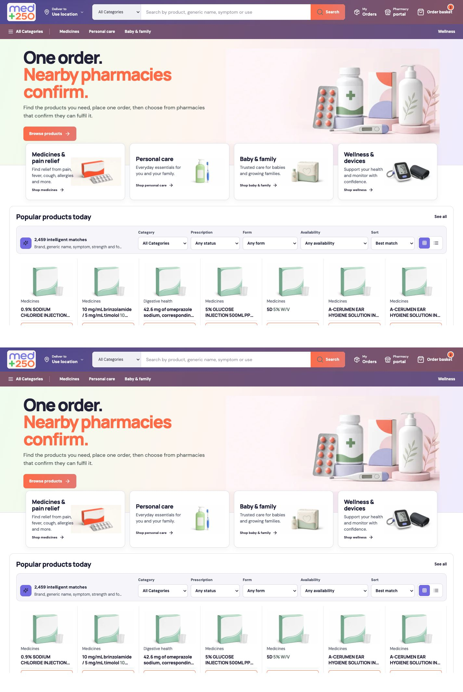
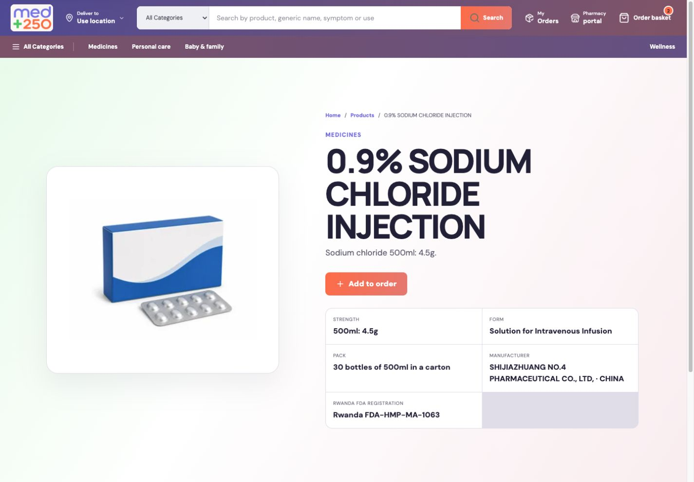
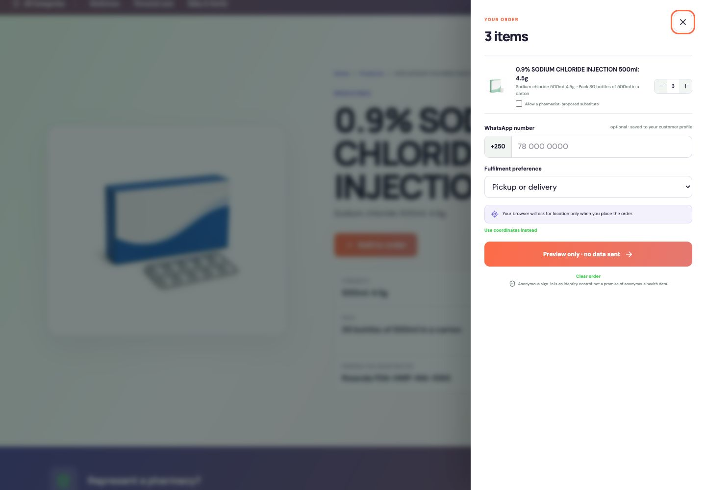
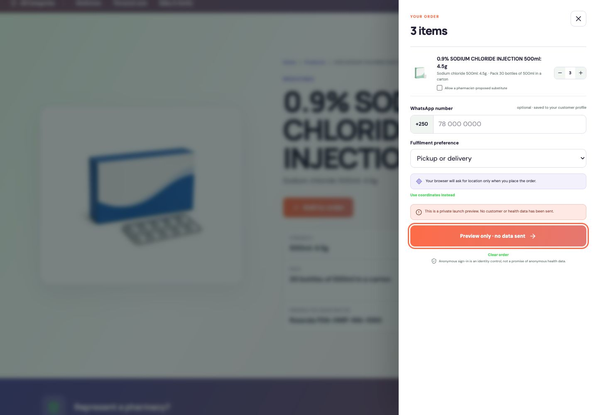
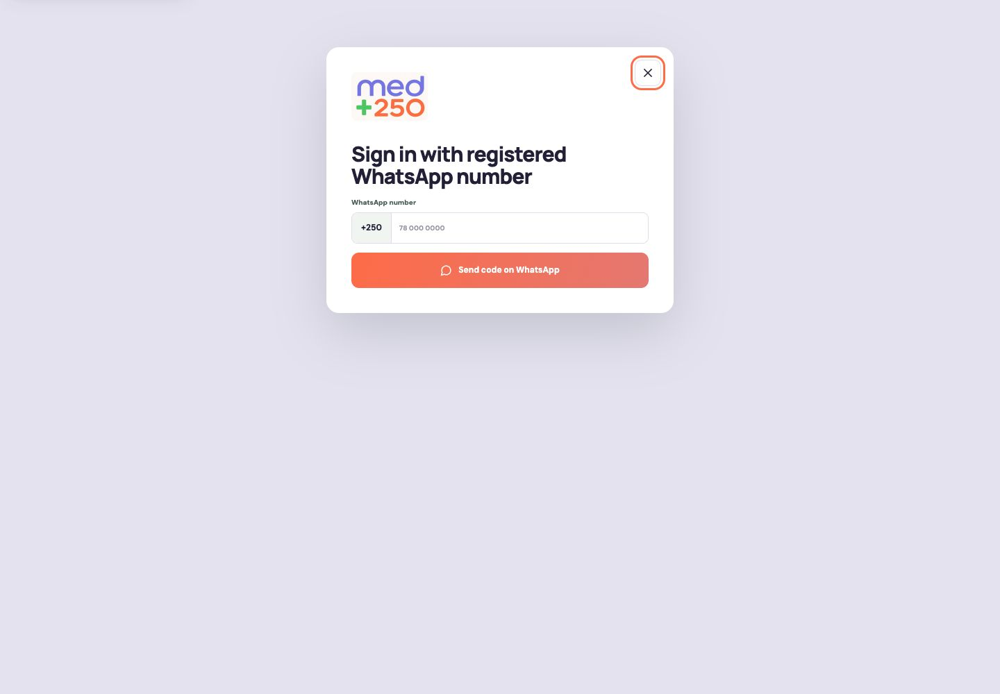
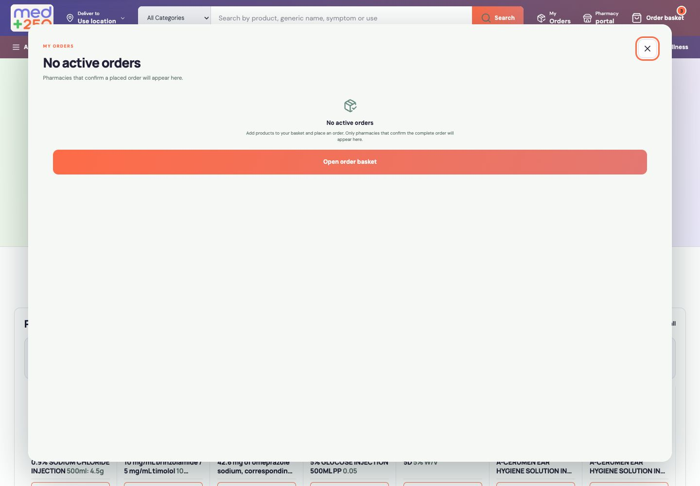
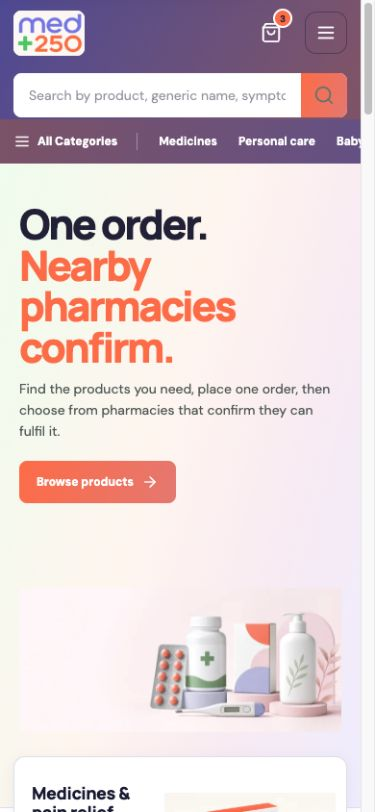
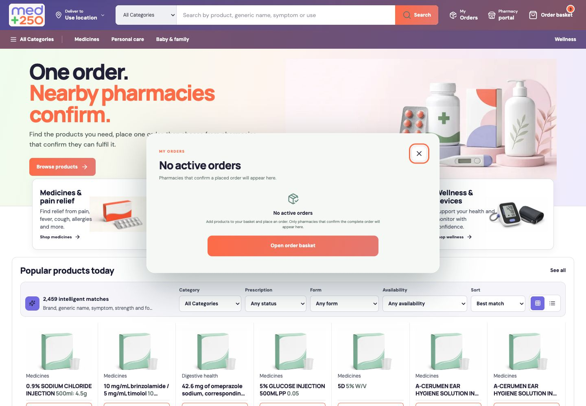

# MED+250 Amazon-alignment full-stack audit

Date: 2026-07-14  
Scope: current customer marketplace, pharmacy workflow, Supabase boundaries, accessibility, responsive UI, SEO, Cloudflare Worker packaging, and production release controls.  
Reference: current Amazon.com home experience captured in the Codex in-app browser at the same 1440 px desktop width.

## Verdict

| Measure | Score | Meaning |
| --- | ---: | --- |
| Amazon-familiar marketplace implementation | **9.5 / 10** | The product-first browse, search, detail, basket, order-status and seller-workspace patterns are implemented and coherent for MED+250's regulated use case. |
| Repository and controlled-preview readiness | **10 / 10** | The full preview release gate passes: build, lint, governed-source validation, 89 tests, performance budgets and strict Cloudflare dry-run. |
| Public operational readiness | **5.5 / 10** | Code is not the main blocker. Pharmacy GPS/contact evidence, credential rotation, deployed security changes, approvals, account authentication and physical UAT remain open. |
| SEO implementation | **9.7 / 10** | Technical SEO is implemented across 2,490 sitemap URLs. Preview mode deliberately blocks indexing until the live gates are approved. |

MED+250 should not copy every Amazon feature. Amazon's public reviews, seller pages, ads, recommendations, stored payments, returns, subscriptions and multi-step account ecosystem would create regulatory, privacy and operational obligations that are outside the approved MED+250 model. The correct target is Amazon-familiar interaction quality with pharmacy-safe disclosure and fulfilment rules.

## Current reference evidence

### Amazon.com reference at 1440 px

### MED+250 desktop marketplace

### Product detail

### One-stage order basket

### Explicit preview safety state

### Registered-WhatsApp pharmacy sign-in

### Original empty order-status state found in this audit

### Mobile marketplace at 390 x 844

### Tightened empty order-status state implemented in this audit

## Amazon comparison scorecard

| Area | Score | Finding | Action/status |
| --- | ---: | --- | --- |
| Header, location, category search and utilities | 9.6 | Amazon-familiar information density is present without copying Amazon branding. Desktop and mobile utilities are responsive. | Complete. Preserve the current MED+250 palette and hierarchy. |
| Browse and category discovery | 9.7 | Four department cards, dedicated category routes, 2,459 orderable matches, filters, sorting and grid/list modes are implemented. | Complete. Do not fabricate products for sparse source categories. |
| Search quality | 9.8 | Exact/generic/strength/form/pack ranking, typo recovery and English/French/Kinyarwanda intent aliases are implemented, with visible match explanations. | Complete. Recheck live trigram-index use after production traffic. |
| Product cards and product detail | 9.3 | Product routes are server-rendered with breadcrumbs, registration, dosage form, strength, pack, manufacturer and Add to order. | Keep governed fallback imagery until pack-photo rights are approved. |
| Basket and conversion | 9.6 | Multi-product basket, quantity, substitution consent, conditional prescription, optional WhatsApp, fulfilment preference, geolocation fallback and one Place order action are implemented. | Complete. Physical GPS and prescription-device UAT remains external. |
| Orders and response comparison | 9.5 | Waiting, no-recipient, expired, confirmed, selected, completed and cancelled states exist. Only complete confirmations are shown and ranked. | Empty My Orders dialog was tightened in this audit. Real response UAT remains external. |
| Pharmacy workspace | 9.4 | WhatsApp OTP, assigned-order queue, complete-order confirmation editor, substitutes, item prices, fulfilment, price contribution and contact-review flows are implemented. | Complete in software. Designated-pharmacy message/session UAT remains external. |
| Mobile UX | 9.5 | Mobile header, horizontal department navigation, hero, catalogue, drawer, dialogs and portal authentication are responsive at 390 x 844. | Complete in browser. Test GPS, WhatsApp and MoMo on real phones. |
| Accessibility | 9.6 | Skip link, landmarks, accessible names, combobox semantics, labelled dialogs, focus containment/restoration, Escape handling, visible focus and reduced-motion support are present. | Lighthouse accessibility reached 100 locally. This is not a formal WCAG conformance audit. |
| Technical SEO | 9.7 | Canonicals, title templates, descriptions, Open Graph, Twitter, manifest, robots, 2,490-URL sitemap, WebSite/Product/Breadcrumb JSON-LD and safe serialization are implemented. | Enable indexing only on the approved live custom domain, then submit the sitemap. |
| Performance | 8.6 | Budgets pass: 555,941 browser JS bytes, 90,134 CSS bytes, 219,841 marketplace JS bytes and 73,183 initial visual bytes. Local mobile Lighthouse performance is 67. | Capture Cloudflare field data; split the large marketplace client only if real LCP/INP justifies it. |
| Security and privacy | 9.2 | RLS/RPC boundaries, separate customer/pharmacy sessions, OTP controls, rate limits, idempotency, Turnstile integration, private prescription access and privacy-safe telemetry are implemented and tested. | Apply the forward hardening only after privileged credentials are rotated, then re-verify the live contract. |
| Cloudflare packaging and release safety | 9.7 | Preview/production Worker identities, bindings, security headers, observability, protected deployment workflow, live attestations and post-deploy verification are implemented. | Strict dry-run passes. Account authentication and domain ownership are external blockers. |
| Operations and marketplace supply | 5.0 | The dispatch algorithm exists, but 0/769 pharmacies have approved GPS and only 267/769 have login-enabled WhatsApp coverage. | This is the largest production gap and cannot be solved by UI code. |

## Implemented customer pages and interactive surfaces

### Pages

- Home marketplace.
- All categories.
- Medicines.
- Personal care.
- Baby and family.
- Wellness.
- Dynamic server-rendered product detail for all 2,480 governed products.
- Privacy.
- Terms.
- Accessibility.
- Loading, application error and not-found states.
- Private pharmacy-entry redirect.
- Robots and sitemap endpoints.
- Privacy-safe telemetry endpoint.

### Wizards, dialogs, drawers and pop-ups

- Search suggestion combobox with keyboard navigation.
- Responsive mobile navigation menu.
- Order basket drawer.
- Manual-coordinate fallback panel.
- Conditional prescription upload.
- Preview-mode no-data-sent alert.
- My Orders/order-status dialog.
- Pharmacy WhatsApp sign-in dialog.
- Six-digit OTP step.
- Unknown-pharmacy administrator recovery dialog.
- Pharmacy workspace with Nearby orders, Product prices and Pharmacy profile tabs.
- Pharmacy contact add/replace/remove review forms.
- Complete-order confirmation editor.
- Customer waiting, confirmed-response, pharmacy-selection and selected-contact states.
- WhatsApp handoff and MoMo USSD launcher after pharmacy selection.

## Full-stack implementation findings

### Customer marketplace — implemented

- Server-ranked, paginated Supabase catalogue search with privacy-safe aggregate price ranges.
- Product-first SSR and immediate 24-product first render.
- One order can contain multiple products.
- Native location is requested only at Place order; manual coordinates are a fallback.
- Anonymous customer identity is created only when a live order is placed and is Turnstile-gated.
- Order attempts are idempotent and recoverable without accidental duplicate dispatch.
- Top-20-within-10-km dispatch logic is centralized and fail-closed on licence, reviewed GPS and verified WhatsApp evidence.
- Realtime complete confirmations are private to the customer order.
- Pharmacy identity and contact remain hidden until the customer selects a complete confirmation.

### Pharmacy workflow — implemented

- Registered WhatsApp-only OTP with origin validation before any side effect.
- Persistent, isolated pharmacy session and active-membership authorization.
- Private assigned-order queue.
- Complete-order confirmation rather than partial seller offers.
- Customer-controlled compatible substitutes.
- Item price, readiness and fulfilment-method confirmation.
- Active-member-only contact visibility and governed contact-edit requests.
- Contact/MoMo/prescription disclosure only after customer choice and within bounded access windows.

### Backend and security — implemented in repository

- Nineteen MED+250 tables are governed by RLS or intentional service-only denial.
- Twenty-six expected public functions are versioned in backend contract `2026-07-14.1`.
- All twelve findings from the sealed deep security scan have repository remediations and regression tests.
- The security refresh covers suspended-member reactivation, contact offboarding, JSON-LD escaping, import provenance, complete-offer disclosure, CI secret scoping, customer rate limiting, atomic OTP issuance, bounded telemetry, disabled-product checks, version-bound GPS approval and bounded prescription cleanup.
- Preview telemetry excludes product names, IDs, phone numbers, exact coordinates, order IDs and prescription contents.

### SEO — implemented and maximized within the approved data model

- 2,480 product URLs plus ten static discovery/policy routes in the sitemap.
- Canonical absolute URLs and live/preview-aware robots controls.
- Accurate WebSite, Product and Breadcrumb structured data.
- A dedicated 1200 x 630 MED+250 social card.
- Open Graph and Twitter summary-card metadata.
- App manifest, theme color, favicon set and Apple touch icon.
- Indexing is denied in preview at metadata, robots and Worker-header layers; this is intentional safety, not an SEO defect.

### Cloudflare — build-ready

- Vinext/Cloudflare Worker package builds successfully.
- Strict Wrangler dry-run succeeds with Assets and Images bindings.
- Preview Worker: `med250-marketplace-preview` with preview release binding.
- Production Worker: `med250-marketplace`, custom-domain routes for `med250.rw` and `www.med250.rw`, and `workers.dev` disabled.
- CSP, HSTS on HTTPS, frame protection, MIME-sniff protection, referrer policy, permissions policy and cross-origin opener policy are applied at the Worker boundary.
- Preview and production deployments are isolated in the package scripts and protected GitHub workflow.
- Post-deploy verification covers representative routes, redirects, HTTPS/security headers, preview noindex, live indexing, robots and sitemap origin/volume.

## Action register to reach a defensible 10/10 live launch

### P0 — required before public ordering

| Owner | Action | Current evidence / acceptance criterion |
| --- | --- | --- |
| MED+250 operations | Approve authoritative GPS points for operating pharmacy premises. | Current: **0/769 GPS-ready**. Each approved record needs reviewer identity and durable evidence. Never infer coordinates. |
| MED+250 operations | Complete registered WhatsApp coverage. | Current: **267/769 pharmacies**, 288 login-enabled contacts. Source must be pharmacy-authorised or authoritative. |
| Security owner | Rotate the previously exposed Supabase service credential, database password and personal token. | Record rotation evidence without placing secrets in the repo. |
| Backend owner | Apply `20260714003000_security_hardening.sql` and `20260714070425_refresh_security_backend_contract.sql`; deploy the revised OTP/cleanup Edge Functions. | Backend contract must return `2026-07-14.1`, 26 functions, no partial-hardening drift. |
| Data owner | Resolve all 51 governed duplicate-register groups. | Current: six product groups plus 45 pharmacy groups are pending named-reviewer decisions. |
| Legal/compliance | Approve source-data reuse, operating model, DPIA/privacy roles, transfers, prescription retention and applicable Rwanda FDA/RICA obligations. | Written approvals tied to the exact release. |
| Cloudflare owner | Authenticate Wrangler, verify the Cloudflare account and `med250.rw` zone, configure protected variables and validate DNS/routes. | Sites access is restored and an owner-only preview is deployed and verified. Wrangler remains unauthenticated, so no production custom-domain deployment was attempted. |
| QA/operations | Run controlled physical-device UAT with designated customer and pharmacy identities. | Verify GPS consent, OTP delivery/session refresh, dispatch, realtime confirmation, selection, WhatsApp, MoMo, cancellation, expiry and prescription access without contacting unintended pharmacies. |
| Release owner | Confirm all 15 fail-closed production attestations. | The live preflight must pass with the production frontend/Worker modes aligned and no secret values printed. |

### P1 — complete before broad acquisition

1. Configure Cloudflare and Supabase alert destinations and the approved prescription-cleanup schedule.
2. Establish real pharmacy price contributions; the current operations snapshot reports no current contributors.
3. Capture field Core Web Vitals after the protected Cloudflare preview and optimize the 220 KB marketplace client only against real LCP/INP evidence.
4. Run a formal WCAG 2.2 AA audit with assistive-technology and human keyboard testing.
5. Validate the production custom domain in Google Search Console and submit the sitemap only after data-publication permission is approved.
6. Monitor crawl coverage, structured-data reports and canonical selection after indexing is enabled.
7. Review the vinext runtime before major scale because it is less mature than the mainstream Cloudflare Next.js path.

### P2 — post-launch quality

1. Add Kinyarwanda and French transactional copy only after the English legal copy is approved.
2. Add product-specific pack images only with verified provenance and pharmaceutical-advertising rights.
3. Expand sparse Personal care and Baby & family coverage only from governed sources.
4. Add additional first-party analytics only after consent, retention and access rules are approved.

## Verification from this audit run

| Check | Result |
| --- | --- |
| Current Amazon reference capture | Pass |
| Current MED+250 desktop, product, basket, preview, pharmacy sign-in, My Orders and mobile captures | Pass |
| Visible My Orders polish remediation | Implemented and recaptured |
| `npm run release:check` | Pass |
| Automated tests | **115/115 pass** |
| Catalogue | 2,480 source-backed products; 2,459 orderable |
| Data validation | Pass with explicit governed-source warnings |
| Performance budgets | Pass |
| Worker strict dry-run | Pass; 3,175.50 KiB upload, 625.67 KiB gzip |
| `git diff --check` | Pass |
| Local mobile Lighthouse | Performance 67, Accessibility 100, Best Practices 100, SEO 69 |
| Preview SEO explanation | The 69 SEO score is caused by intentional preview noindex. Live indexing is release-gated. |
| Sites deployment | Pass; owner-only preview deployed at `https://med250-rwanda.ikanisa.chatgpt.site` |
| Authenticated post-deploy verification | Pass; seven representative routes, redirects, security headers and preview noindex verified with zero errors |
| Direct Wrangler deployment | Blocked before deployment because the Cloudflare account is not authenticated |
| Live release preflight | Correctly fails on preview/live mismatch, missing live variables and 15 unconfirmed attestations |

## Evidence limits

- No real customer order or pharmacy notification was sent in this audit.
- No privileged production migration, DNS change or public deployment was attempted.
- No real WhatsApp OTP, physical GPS, WhatsApp or MoMo handoff was executed.
- Accessibility evidence is automated and browser-based, not a certification.
- The prior live-database lifecycle evidence used rollback-only synthetic transactions; it does not replace physical-device UAT.
- Amazon is a current interaction reference, not a requirement to reproduce Amazon's commercial, advertising, review, payment or returns ecosystem.

## Release decision

- **Software implementation:** ready.
- **Controlled preview package:** ready.
- **Public live ordering:** hold until all P0 evidence is complete.
- **SEO activation:** hold indexing until the approved live custom domain is deployed and verified.

## 2026-07-14 implementation continuation

The revoked Sites refresh token was repaired by re-authenticating the connected account. The exact validated source was then published as a private, owner-only Sites preview and checked through the authenticated deployment verifier.

### Newly completed controls

- Added `data/launch-evidence.json`, a machine-readable registry containing the exact 15 fail-closed production gates.
- Added schema and integrity validation that rejects missing gates, evidence-free confirmations, secret-like evidence references, unnamed approvers and future approval timestamps.
- Made strict evidence validation the first live-release preflight step. All 15 gates remain pending by design.
- Added WCAG AA contrast regression coverage for every MED+250 action-gradient endpoint and changed action text to the dark brand ink color.
- Added direct unit coverage for healthy, degraded and critical operational-health snapshots.
- Added owner-only Sites verification through a protected request header; credentials are never placed in the URL or output.
- Deployed and verified `https://med250-rwanda.ikanisa.chatgpt.site` as a private preview with public ordering and search indexing disabled.

### Updated release evidence

| Check | Result |
| --- | --- |
| Production build plus full automated suite | **115/115 pass** |
| Launch-evidence registry | Valid; exact 15 gates present and pending |
| Strict live evidence preflight | Correctly fails closed on all 15 pending gates |
| Private Sites deployment | Succeeded |
| Authenticated deployed-route verification | **7 routes, 0 errors** |
| Preview publication state | Owner-only, noindex, ordering disabled |
| Production custom domain | Not deployed; Wrangler authentication and external approvals remain pending |

This raises deployment readiness without changing the audit's core release decision: the implementation and controlled preview are ready, but public ordering and SEO activation must remain off until all 15 production gates have durable evidence and named approval.

### Evidence-control hardening continuation

- Upgraded the launch registry to schema v2 so each gate declares and requires semantically appropriate evidence categories.
- Repository evidence is now verified against a recorded SHA-256 digest.
- A confirmed gate now requires the approver's name, accountable role and an ISO 8601 timestamp with an explicit timezone.
- Added `npm run launch:evidence:status` to report every owner, acceptance criterion, missing evidence category and approval state.
- Added a complete 15-gate closure and physical-device UAT runbook at `docs/launch/production-evidence-runbook.md`.
- Re-checked the live external state: Sites version 8 is active, custom/owner-only and preview-mode; both intended custom domains are attached but remain pending; `med250.rw` and `www.med250.rw` still do not resolve; Wrangler remains unauthenticated.
- Read-only Supabase probes confirm the backend-contract and operational-health RPCs deny the publishable role with HTTP 401. The public Auth settings response does not prove Turnstile or anonymous-sign-in configuration, so those attestations remain pending.
- Rebuilt the exact hardened source in preview mode, published it privately as Sites version 8 and re-ran authenticated post-deployment verification: seven routes passed with zero errors.
- Re-ran the explicit production artifact verification without publishing: production metadata/robots/sitemap tests passed and Wrangler strict dry-run succeeded at 3,194.46 KiB upload / 630.06 KiB gzip.

### Domain, duplicate-review and physical-UAT continuation

- Attached `med250.rw` and `www.med250.rw` to the verified owner-only Sites deployment without changing DNS, access policy, marketplace mode or indexing.
- Captured the provider-issued apex, CNAME, ownership and certificate-validation records in `docs/launch/dns/med250-sites-domain-plan.json`.
- Added `npm run domain:dns:verify`; it currently reports pending with 0/6 records visible. TXT ownership values remain case-sensitive, while DNS names/CNAME targets are normalized correctly.
- Added an explicit routing-owner safety rule: the same hostname must not be assigned simultaneously to Sites and the direct Wrangler production routes.
- Added a deterministic 51-group reviewer packet with exact source values, field differences and source-file digests; it contains no regulatory decision or recommendation.
- Added a 12-scenario physical-device UAT ledger and strict validator that rejects missing scenarios, missing evidence, unnamed operators/approvers, timezone-free timestamps, phone numbers, OTPs, UUID-like order IDs, exact coordinates and secret-like material.
- Made the strict UAT verifier mandatory in both `release:check:live` and the protected GitHub production workflow.

### Evidence-artifact integrity continuation

- Added gate/type-specific evidence template generation for all seven evidence categories.
- Added standalone artifact validation plus automatic registry-time validation of local completed JSON evidence.
- Local evidence must live under `docs/launch/evidence/`, match its SHA-256 digest, declare the exact gate and type, confirm redaction, contain passed checks and satisfy type-specific approval, test, review, deployment, account, domain or operations fields.
- Access-controlled HTTPS evidence now requires a named verifier, verifier role and timezone-qualified verification timestamp in the registry.
- Evidence artifacts reject secret-like material, Rwandan phone numbers, OTP disclosures, email addresses and precise coordinate pairs.
- Re-audited external state with no change: 15/15 gates pending, 0/6 DNS records present, 51/51 duplicate groups pending, 12/12 UAT scenarios pending, no privileged local credentials and no authenticated Wrangler session.

### Final completion and blocked audit

The full objective remains incomplete after three consecutive evidence-based goal turns for the same external reasons. The repository and private deployment are verified, but launch completion requires actions that cannot be inferred or fabricated:

- 15/15 named production attestations remain pending.
- 51/51 duplicate-register decisions require the named regulatory reviewer.
- 12/12 physical-device scenarios require real approved identities, devices and QA sign-off.
- 0/6 Sites routing/validation DNS records are visible; both hostnames and certificates remain pending.
- Wrangler is unauthenticated and no Cloudflare API credentials are available.
- No privileged Supabase key is available for backend-contract or operational-health verification.
- No geocoding/admin/cron credentials are available for pharmacy readiness or cleanup scheduling.
- Authoritative GPS approval remains 0/769 and WhatsApp coverage remains 267/769.

The definitive machine-readable blocker snapshot is `desktop-output/goal-progress-2026-07-14/05-final-blocker-audit.json`. Public ordering and indexing remain fail-closed.
