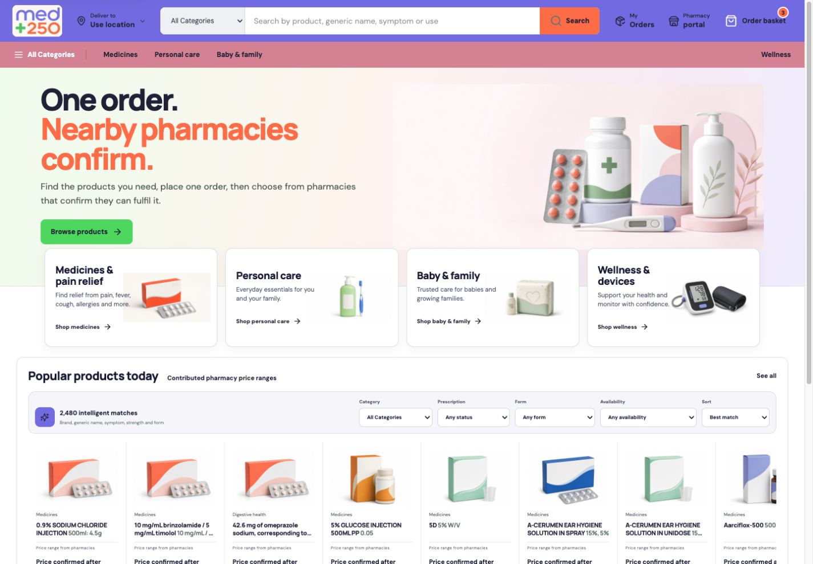
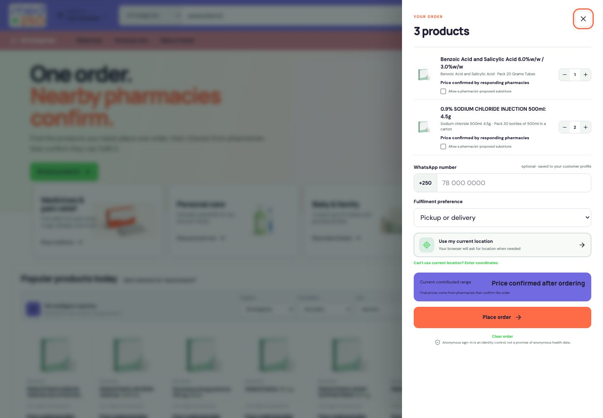
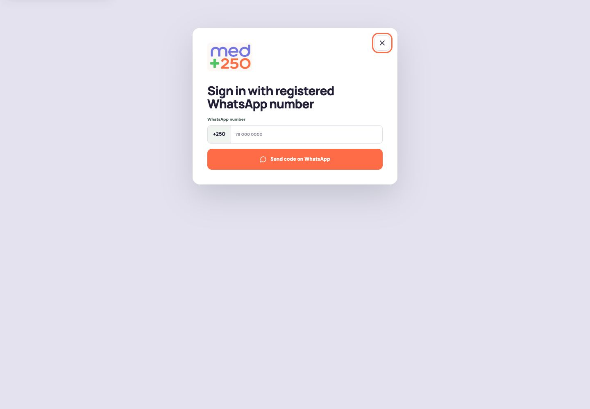
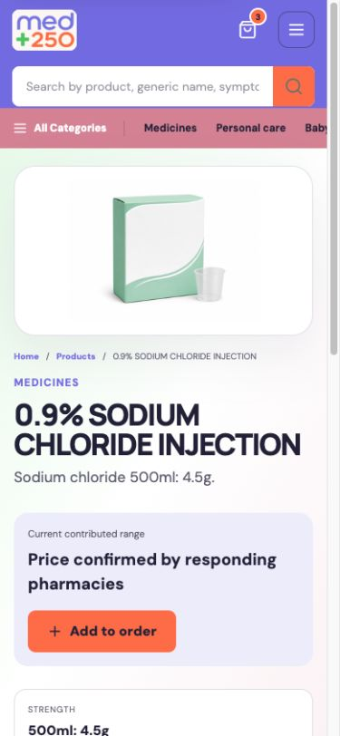
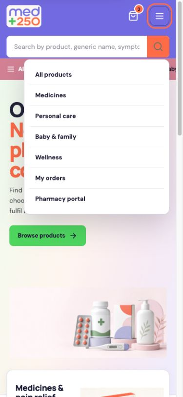
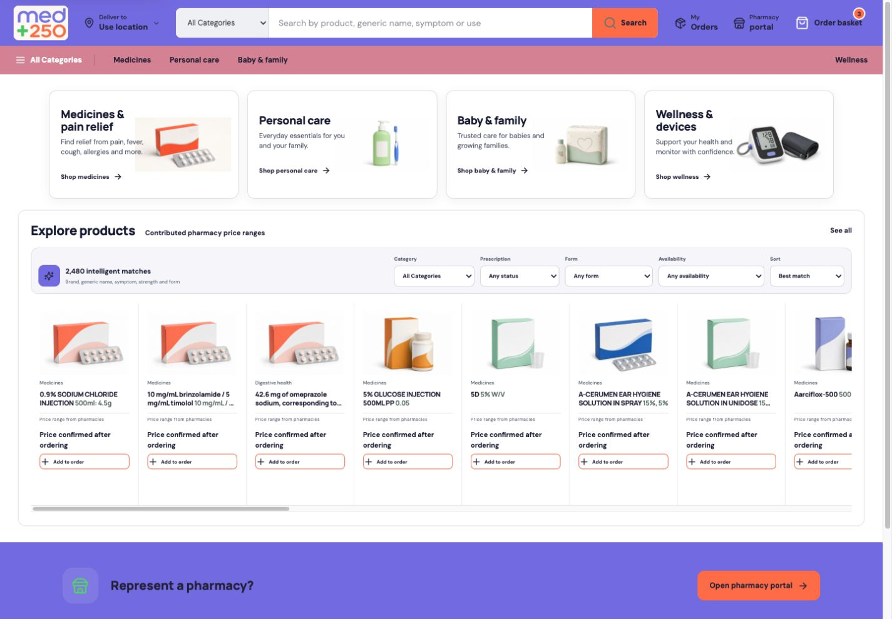

# MED+250 Full-Stack Marketplace Audit

Date: 2026-07-13  
Scope: customer marketplace, pharmacy portal, Supabase backend, source data, accessibility, responsive behaviour, SEO, Cloudflare Worker packaging, and launch readiness.

## 2026-07-14 implementation reconciliation

The repository-controlled follow-up is complete. The forward security hardening remains intentionally unapplied to the live Supabase project until the previously exposed privileged credentials are rotated, but the repository now includes both the hardening migration and a versioned contract refresh that prevents a correctly hardened database from being rejected as API drift.

- Backend deployment contract: `2026-07-14.1`, expecting 26 public MED+250 functions and explicitly proving the atomic OTP, version-bound geocode approval, contact-retirement, offer-product, order-rate-limit and complete-offer disclosure safeguards.
- Production release locks: expanded from ten to fifteen. Security migration deployment, revised Edge Function deployment, prescription-retention approval, Cloudflare-account verification, and domain/DNS verification are now independent fail-closed attestations.
- Deployment workflow: production attestations and governed-source review now execute before the privileged Supabase verification step receives its secret.
- Executable verification: the contract refresh runs in an isolated PostgreSQL-compatible database and proves service-role-only access.
- Full current gate: 88 / 88 tests pass; lint, source-data validation, catalogue quality, performance budget, dependency audit and strict Cloudflare dry run pass.
- Live preflight: correctly fails while preview mode is active and all fifteen evidence-backed launch attestations remain unset.

This reconciliation strengthens the controlled-preview result. It does not change the public launch decision: live ordering remains on hold until the external and deployed-state gates below are evidenced.

## Executive verdict

MED+250 is now a coherent product-first marketplace implementation rather than a pharmacy directory or a simple brochure website. The customer journey is intentionally short: find products, add to order, share location, place the order, then view only pharmacies that confirm the complete order. The UI, key dialogs, category routes, product routes, policy pages, metadata, sitemap, robots rules, and Cloudflare Worker package are implemented and pass the local verification suite.

The code and Worker bundle are ready for a controlled Cloudflare deployment. The marketplace is **not ready for unrestricted public live ordering** because the operational data needed by the core dispatch rule is incomplete: none of the 769 pharmacy records currently has a verified GPS point, and only 267 pharmacies currently have at least one login-enabled WhatsApp contact. Cloudflare authentication, final domain/DNS configuration, written source-data permission, and regulated launch gates also remain external actions.

Implementation quality: **8.6 / 10**  
Public live-launch readiness: **5.4 / 10**

## Evidence basis

- Current local website inspected in the Codex in-app browser at desktop and mobile widths.
- Built and tested from the canonical repository at `/Volumes/PRO-G40/MED250`.
- Live Supabase project reviewed for migrations, table security, catalogue state, pharmacy approval, GPS coverage, WhatsApp coverage, database-advisor output, and a rollback-only lifecycle transaction.
- Cloudflare Worker production package built and validated with a strict Wrangler dry run.
- Lighthouse 12.8.2 mobile throttling and a 200-request local concurrency probe were run against the built `vinext start` production server. These are local package measurements, not a substitute for post-deployment Cloudflare field data.

## Flow health

1. **Home and navigation — healthy.** The primary experience leads with products, uses the med+250 brand assets, supports desktop and mobile navigation, and no longer presents a public pharmacy directory.
2. **Semantic search — healthy.** Live search is paginated and ranked in Supabase across product name, generic, strength, form, full-text terms, trigram typo recovery, and English/French/Kinyarwanda aliases. It returns public product fields and aggregate price ranges only; the browser scorer is retained for preview/offline fallback. Suggestions expose combobox/listbox semantics and support arrow-key navigation and Escape.
3. **Categories and filters — healthy.** Dedicated category routes exist for medicines, personal care, baby and family, and wellness. The categories route contains filter and sort controls and uses Order language throughout.
4. **Product detail — healthy.** Product pages server-render source data, expose breadcrumbs, registration details and an immediate Add to order action. Inactive/grace-period records remain visible but are not orderable.
5. **Order basket and location — healthy UI; deployed transaction verified.** Customers can add multiple products, open the basket, use native geolocation or manual coordinates, add optional WhatsApp, and place one order. The dialog is keyboard-contained, Escape-closeable, labelled, and restores focus. The deployed order RPC passed rollback-only dispatch and idempotency UAT; real dispatch remains blocked by GPS data.
6. **Confirmed-pharmacy results — database lifecycle verified; physical/message UAT pending.** Only complete pharmacy confirmations are returned to the customer, ranked by distance and total. A rollback-only live transaction proved recipient membership isolation, server-calculated confirmation, pre-selection privacy, cross-customer denial, selection/contact release, completion and notification lifecycle. No real pharmacy was contacted.
7. **Pharmacy WhatsApp OTP — state machine and origin boundary verified; incomplete contact coverage.** The portal has no email flow. It validates a registered pharmacy WhatsApp number, sends a six-digit Cloud API template OTP, keeps the successful browser signed in until logout, and sends unknown numbers to the admin WhatsApp exception path. Rollback UAT proved the database challenge states; live HTTP UAT proved rejected origins have no send/consume/identity side effect. Successful real-message/session testing still needs a designated pharmacy number.
8. **Pharmacy workspace and confirmation editor — healthy implementation; not live-message tested.** Staff can view dispatched orders and confirm the complete basket with item prices, compatible substitutes, readiness and note. The editor now behaves as a labelled modal dialog with Escape and focus containment.
9. **Policy and failure states — healthy.** Privacy, terms, accessibility, loading, not-found and application-error surfaces exist and share the same design system.
10. **SEO and discovery — healthy.** Canonicals, title templates, descriptions, Open Graph/Twitter metadata, manifest, robots, WebSite/Product/Breadcrumb structured data and a 2,490-URL sitemap are implemented. The product SEO index covers all 2,480 source products. A bespoke 1200 x 630 MED+250 marketplace social card now carries the product-first promise; product JSON-LD deliberately does not misrepresent that marketplace card as an individual product image.
11. **Cloudflare package — healthy dry run.** The Worker bundle passes strict dry-run validation with static assets and Cloudflare Images bindings. Security headers are applied at the Worker boundary.
12. **Performance and accessibility — budgeted and materially improved.** The storefront now server-renders an immediate 24-product catalogue, keeps connected previews on paginated Supabase search, uses display-sized/WebP assets, and avoids the 1 MB fallback CSV unless no backend is configured. Mobile Lighthouse moved from 96 to 100 accessibility, 89 to 100 best practices, 16.3 s to 5.7 s local throttled LCP, 160 ms to 0 ms blocking time, and 3,161 KiB to 901 KiB transfer. The 69 SEO score is solely the intentional preview `noindex`; live indexing remains release-gated.

## Remediation completed

### Marketplace UX

- Reframed the experience as product-first and removed vendor-directory framing.
- Replaced Request language with Order language throughout the visible experience.
- Added dedicated category routes and a responsive mobile menu.
- Added product breadcrumbs, server-rendered product details, dynamic page metadata and mobile-first Add to order placement.
- Added an accessible search combobox, skip links, visible focus treatment and reduced-motion handling.
- Added semantic dialogs and focus management for basket, order status, pharmacy authentication, workspace, contact-admin exception and pharmacy confirmation editor.
- Added concise policy/help/footer routes and meaningful error, loading and 404 pages.

### Backend and data

- Confirmed 2,480 products in the live project: 2,430 valid, 29 expiring soon and 21 grace-period records.
- Confirmed 2,459 products are currently orderable; the 21 grace-period rows are inactive and not orderable.
- Confirmed 769 pharmacy records and automatic marketplace approval for all 769.
- Confirmed all 19 MED+250 tables have row-level security enabled.
- Confirmed latest product-first/private-confirmation catalogue migrations are applied.
- Deployed and anonymously exercised the `SECURITY INVOKER` catalogue-search RPC; `PUBLIC` execution is revoked and only `anon` and `authenticated` have explicit execution rights.
- Repaired ambiguous `ON CONFLICT` targets in four lifecycle functions after live rollback UAT proved that the old `order_id` target collided with a PL/pgSQL output variable. The named unique constraint is now used in both the clean base migration and deployed functions.
- Executed the durable `tests/live-marketplace-rollback.sql` harness against the live project. All nine workflow groups passed and the transaction rolled back; follow-up verification found zero rollback fixtures, zero ambiguous lifecycle functions and zero `PUBLIC` execute grants on the repaired functions.
- Confirmed WhatsApp OTP has origin checks, phone normalization, purpose-bound hashed codes, five-minute expiry, attempt limits and source/phone/global rate limits.
- Moved OTP origin checks ahead of every side effect in both deployed Edge Functions. Version 4 of send and verify now rejects an untrusted origin before input parsing, rate-limit writes, challenge creation, WhatsApp delivery, OTP consumption, Auth administration or session creation.
- Executed `tests/live-pharmacy-otp-rollback.sql` against the live project: service-only access, correct code, single use, wrong-code retry, expired code and malformed input all passed with rollback. Live disallowed-origin requests returned 403 and left challenge state unchanged; allowed-origin validation retained its expected CORS response.

### SEO and Cloudflare

- Generated a deterministic product SEO index and server-rendered product pages.
- Added canonical metadata, a bespoke 1200 x 630 marketplace social preview, accurate structured data, `robots.txt`, manifest and sitemap.
- Added `wrangler.jsonc`, generated Worker types and a repeatable `cloudflare:check` command.
- Added CSP, HSTS on HTTPS, frame protection, MIME-sniff protection, referrer policy, permissions policy and cross-origin opener policy.
- Added Cloudflare activation instructions and secret-handling boundaries to the repository documentation.
- Separated the default `med250-marketplace-preview` Worker from an explicit production environment. The production artifact disables `workers.dev`, targets both MED+250 custom-domain routes, and receives the live release binding only when built with `CLOUDFLARE_ENV=production`.
- Added secret-free GitHub quality automation plus manual, environment-protected preview/production deployment. Production requires an explicit confirmation phrase and all data, backend, operations, regulatory and physical-UAT gates before Cloudflare credentials are used.
- Repaired and regression-tested the production deployment commands so both local and GitHub release paths explicitly use `--env production`; the preview job continues to target only the default preview Worker.
- Added a self-contained production artifact check that builds live frontend metadata together with the production Worker, runs the three production build assertions, and performs a strict no-upload dry run.
- Added post-deploy verification for seven routes, redirect containment, HTTPS/security headers, preview noindex protection, live custom-domain indexing, robots rules and sitemap volume/origin.

## Open findings and action points

### P0 — blockers before live ordering

1. **Pharmacy GPS coverage is 0 / 769.** The top-20-within-10-km algorithm cannot dispatch a live order until authoritative premises coordinates are obtained and approved. Do not invent coordinates or trust stale map candidates.
2. **Pharmacy login coverage is 267 / 769.** There are 288 login-enabled WhatsApp contact records covering 267 pharmacies; 502 pharmacies have no known phone/WhatsApp source. Complete contact enrichment from pharmacy-authorised or authoritative sources.
3. **Cloudflare account is not authenticated locally.** Wrangler 4.110.0 is installed and both preview and production artifacts validate locally, but `wrangler whoami` reports no authenticated account. Run `wrangler login`, verify account and `med250.rw` zone ownership, inspect existing Worker/route state, set protected variables, then perform a protected preview deployment before production DNS cutover. Redacted evidence is saved in `desktop-output/completion-audit-2026-07-13/cloudflare-account-readiness.json`.
4. **Regulated launch gates remain.** Obtain written source-data reuse permission, privacy/DPIA and controller/processor clearance, required transfer approval, pharmacy operating confirmation, and any Rwanda FDA/RICA requirements before public operation.
5. **Run controlled live UAT.** Use designated test customer and test pharmacy identities to verify native GPS consent, order dispatch, OTP delivery, realtime response, confirmation ranking, WhatsApp handoff, cancellation and expiry without contacting unintended pharmacies.

### P1 — complete before broad public launch

1. **Controlled but pending external review:** all six duplicate product registration-number groups and 45 duplicate pharmacy professional-registration groups now have a deterministic 51-row review ledger tied to their exact source references. Preview validation fails if that ledger drifts; the strict live gate rejects every `pending` or `blocked_source_correction` row. All 51 decisions remain pending a named authorised reviewer.
2. **Completed:** the GraphQL/table, privileged RPC, pharmacy GPS-review, member-contact and contact-review surfaces are enforced by backend contract `2026-07-13.7`. All 24 MED+250 functions and 19 tables must match explicit counts and allowlists; `PUBLIC` execution, unauthenticated privileged RPCs, mutable privileged search paths, disabled RLS, unexpected authenticated table access, undocumented policy-less tables, missing GPS-review safeguards, verified coordinates without reviewer evidence, exposed contact-review operations, contact decisions without operator evidence, and member-contact access without active membership fail verification. Eight service-only tables intentionally use RLS with no policy, while eight authenticated tables use owner/member policies.
3. **Turnstile client integration is complete; server activation remains gated.** Confirm Supabase Auth is configured to validate Turnstile tokens, approve project-wide anonymous-auth rate limits after reviewing impact on other applications, then record both live-release attestations.
4. **Core monitoring is implemented; account-level alerts remain.** Cloudflare now receives privacy-safe request and bucketed marketplace signals, while a service-only Supabase snapshot reports OTP delivery, dispatch counts, confirmation latency, catalogue/price coverage and cleanup health. Configure Cloudflare/Supabase alert destinations and the approved cleanup cron schedule during protected deployment.
5. Recheck the new trigram index after production-like traffic. Supabase currently reports it as unused because it was just created and the catalogue is small; the first-page live `omeprazole` query measured about 192 ms during this audit.
6. Capture production Core Web Vitals and optimize the large marketplace client/SSR module if real traffic shows LCP, INP or memory pressure.
7. Validate the final production domain in Google Search Console and submit the generated sitemap only after the data-publication permission is cleared.

### P2 — post-launch quality

1. Add Kinyarwanda and French content only after the English transactional copy is legally approved.
2. Add audited product imagery only where provenance and pharmaceutical-advertising use are cleared.
3. Define consent, retention and access rules before adding any third-party analytics beyond the implemented first-party aggregate signals.
4. Reassess the current vinext runtime before major scale; it passes this build but remains less battle-tested than the mainstream Cloudflare Next.js path.

## Validation results

- `npm run lint`: pass, zero warnings.
- `npm test`: pass, 74 / 74 tests, including executable price contribution conflict targeting, centralized dispatch eligibility without an online-premises gate, execution of the real client scorer, multilingual alias precedence, deterministic duplicate-register review and strict blocking, PostgreSQL search, operational-health and backend-contract migrations, full function/table/GPS/contact-governance drift checks, transactional contact review, active-member-only contact access, real add/replace/remove contact UI, process-only admin tooling, mandatory live-gate database/health ordering, service-only monitoring permissions, database privilege and Realtime drift detection, privacy-safe telemetry, order rollback contract, OTP origin/state contract, social-card dimensions, local-production Worker compatibility, deployment workflow isolation, post-deploy route/indexing checks, immediate server-rendered catalogue and live custom-domain security headers.
- Fresh rendered-browser QA passed at 1440 x 900 and 390 x 844. Clean tabs had the expected page identity, meaningful server-rendered content, no framework overlay and zero console warnings/errors. Kinyarwanda `ububabare` search returned 200 live Pain & fever matches with visible match explanations; the tested product add raised the basket from 3 to 4 and its exact removal restored 3.
- The preview order CTA returned the explicit no-data-sent alert, invalid manual coordinates were rejected, and the pharmacy portal rejected an invalid Rwanda WhatsApp number before any OTP request. The mobile category route, navigation menu and order drawer had no page-level horizontal overflow; the drawer had `aria-modal=true`, trapped reverse focus inside the dialog, closed on Escape and restored focus to the basket trigger.
- The structural browser pass found one `main`, one `h1`, `lang=en-RW`, no duplicate IDs, no missing image alt attributes, no unnamed buttons/links, no unlabeled inputs and no document-level horizontal overflow on either tested viewport.
- `npm run performance:budget`: pass — 554,953 browser JavaScript bytes, 86,760 CSS bytes, 218,853 marketplace-chunk bytes and 73,183 bytes across the display wordmark plus ten optimized marketplace visuals.
- `npm run data:validate`: pass with the documented duplicate-source warnings.
- `npm run cloudflare:check`: pass.
- `npm run release:preflight:live`: intentionally blocked. The fail-closed validator confirmed preview mode and enumerated all ten unresolved launch attestations without printing any secret values.
- Worker dry-run package: 2,971.42 KiB total, 599.36 KiB gzip.
- Separate live-environment package check: pass, 3 / 3 production-build assertions and strict dry-run upload of 2,982.12 KiB total, 602.23 KiB gzip. This validated the production identity, custom-domain routes, live metadata and indexing output without publishing anything.
- Live service-only operations snapshot deployed and verified: anonymous/authenticated execution denied; 2,459 orderable products, 769 active/approved pharmacies, 0 GPS-ready/dispatch-ready, 267 pharmacies with WhatsApp contacts, 288 login-enabled WhatsApp contacts, zero current price contributions and cleanup correctly marked `never_run` because no approved cron schedule exists.
- Fresh live-mode browser QA: Turnstile challenge rendered at desktop and 390 x 844 mobile width; customer basket and pharmacy portal emitted no warnings or errors; no order or OTP was submitted.
- Sitemap: 2,490 URLs.
- Responsive browser checks: home, categories, product, basket, mobile menu, pharmacy login and help page inspected without horizontal overflow.
- Mobile Lighthouse: performance 67, accessibility 100, best practices 100 and SEO 69 in preview mode; LCP 5.7 s, TBT 0 ms, CLS 0 and 901 KiB transferred. Local `vinext start` does not apply Cloudflare text compression, and preview intentionally blocks crawling, so production field metrics and live-domain SEO must be measured after protected deployment.
- Local concurrency probe: 200 completed requests at concurrency 20 with zero failures; 22.74 requests/second, 891 ms p95 and 925 ms maximum on the logging-enabled local runner.
- Live search UAT: 2,459 initial orderable matches, three correctly ranked `brinzolamde` typo matches, 200 `ububabare` matches with related-use explanations, six Personal care results, and a 24-product first page; browser logs contained no warnings or errors.
- Follow-up rendered UAT repaired a preview-only multilingual ranking regression: `umutwe` now ranks exact headache aliases above fuzzy brand-name resemblance, while live mode preserves the server RPC order without a second client-side sort. The test suite includes a diabetes-brand decoy to prevent recurrence.
- Follow-up desktop and 390 x 844 checks verified saved-basket restoration, product-detail add/remove, manual-coordinate errors and success, mobile menu Escape behavior, basket and portal panel bounds, unregistered-pharmacy admin WhatsApp routing, modal focus restoration, named compact controls, image alternative text, initial loading state and a clean console. No real order or WhatsApp message was sent, and the synthetic suppressed OTP rate-limit row was removed after the test.
- Continuation UAT rechecked the live-ranked Kinyarwanda `umutwe` flow, Personal care category, product detail, reversible add/remove interaction, responsive basket, and WhatsApp login validation on desktop plus 390 x 844 mobile. It found and fixed one quantity-copy defect: a basket with multiple units now reports `items`, rather than implying every unit is a distinct product. The final release gate passes 74 / 74 tests with a clean browser console.
- A fresh Supabase advisor and deployment review found no MED+250 `ERROR`-level findings and no MED+250 Edge Function 5xx responses in the available 24-hour log window. Advisor warnings for authenticated workflow functions, GraphQL-visible catalogue/owner tables, and anonymous customer ownership are intentional parts of the executable allowlisted/RLS contract; eight no-policy tables are deliberately service-only. The shared-project `env-dump` function was inspected and is a retired HTTP 410 endpoint that returns no environment data.
- Pharmacy GPS governance is deployed without fabricating coordinates: candidate generation uses Google Places Text Search with strict pharmacy-type filtering, every approval requires the exact staged Place ID plus a named reviewer and evidence note, the database rejects unreviewed verification, and a conditional-write guard prevents a slow candidate lookup from overwriting a concurrent human approval. Edge Function v4 adds a protected `inspect` review packet and bounded process-only CLI; its unauthenticated probe returns 403. The live contract reports all GPS-governance invariants healthy and still reports 0 verified pharmacies, so dispatch remains safely blocked.
- Pharmacy contact corrections now have a complete operator path. A custom-token Edge Function and process-only CLI list and inspect pending requests, while a service-only transaction approves or rejects exactly one request with reviewer evidence. Approved WhatsApp changes become login-enabled and create a matching phone contact; replay and batch review are blocked. Live rollback UAT proved approval, phone mirroring, summary synchronization, evidence, replay denial and rejection, then confirmed zero fixtures remained. Contact-review Edge Function v1 returns 403 without its admin token.
- Pharmacy staff now see only their active pharmacy's linked contacts and pending edits in the authenticated Profile tab, with explicit add, replace and removal requests. A new active-member-only RPC denies anonymous, non-member and cross-pharmacy reads; rollback UAT proved each boundary and left zero fixtures.
- Live rollback UAT: dispatch, retry idempotency, membership isolation, complete confirmation, pre-selection privacy, customer ownership, selection/contact release, completion and notification lifecycle all passed with no persisted fixtures.
- OTP UAT: rollback state-machine checks passed; deployed send/verify functions rejected an untrusted origin before side effects, created no challenge, did not consume the seeded code and returned no allow-origin header.

## Screenshots

### Home after remediation

### Order basket after remediation

### Pharmacy WhatsApp login after remediation

### Product detail on mobile after remediation

### Mobile marketplace navigation

### Product categories after remediation

## Evidence limits

- No real customer order was created and no pharmacy was notified.
- Synthetic order-lifecycle fixtures were used only inside a live transaction that ended with `ROLLBACK`; this proves database behavior but not WhatsApp delivery, browser permissions or physical-device handoff.
- No WhatsApp OTP was sent to a real pharmacy number.
- OTP delivery and permanent-session refresh remain unproven on a physical device; automated tests intentionally stopped before real Cloud API delivery.
- Browser geolocation permission was not granted during the audit.
- No production domain, DNS, TLS or Cloudflare runtime deployment was available to test.
- No authenticated pharmacy workspace could be exercised without a designated registered test number.
- No runtime Core Web Vitals trace or assistive-technology screen-reader session was captured.
- Accessibility findings are implementation and keyboard-flow evidence, not a formal WCAG conformance claim.

## Primary technical references

- Cloudflare Workers Vite plugin: https://developers.cloudflare.com/workers/vite-plugin/
- Wrangler configuration: https://developers.cloudflare.com/workers/wrangler/configuration/
- Google Product structured data: https://developers.google.com/search/docs/appearance/structured-data/product
- Supabase database linter: https://supabase.com/docs/guides/database/database-linter
- Supabase full-text search: https://supabase.com/docs/guides/database/full-text-search
- Google Places Text Search (New): https://developers.google.com/maps/documentation/places/web-service/text-search
