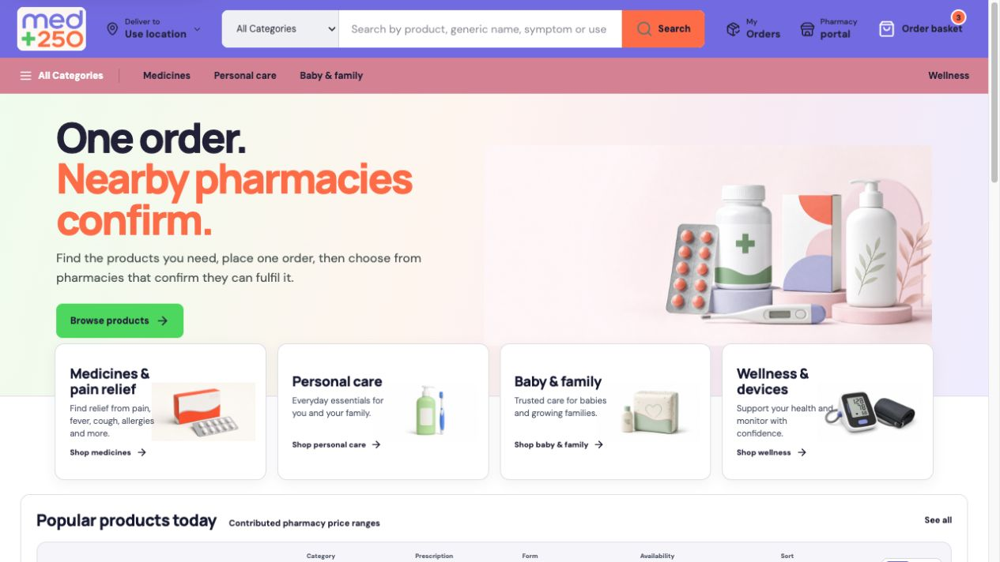
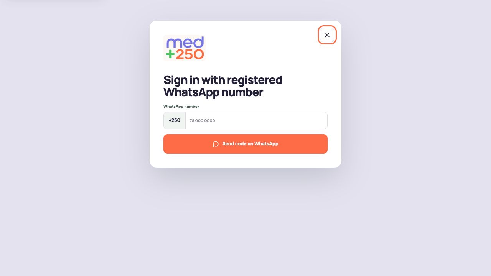
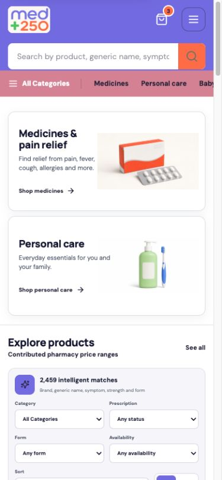

# MED+250 Amazon Alignment Implementation

Date: 2026-07-13  
Repository: `/Volumes/PRO-G40/MED250`  
Scope: corrected 28-point product-marketplace roadmap, full-stack implementation, browser UAT, Supabase hardening, SEO, and Cloudflare build readiness.

## Outcome

MED+250 is implemented as a product-first pharmacy marketplace: customers search a shared catalogue, add several products to one order, place it once, and see only pharmacies that confirm they can fulfil the complete order. Public pharmacy discovery, vendor badges, ratings, profiles, nearby-pharmacy counts, multi-stage checkout, and integrated payment infrastructure are intentionally absent.

Implementation alignment: **9.5 / 10**  
Public operational readiness: **5.5 / 10**

The software path is substantially complete. Public ordering remains blocked by operational data and account-bound launch work: 0 of 769 pharmacy records currently have an approved GPS point, 267 pharmacies have a verified login-enabled WhatsApp contact, and production Cloudflare/domain credentials and controlled live identities were not available for end-to-end message dispatch. The three-record online-premises source flag is retained as information only and no longer gates this product-based marketplace.

## Corrected roadmap status

| # | Requirement | Status | Evidence |
| ---: | --- | --- | --- |
| 1 | Catalogue quality checks | Complete | `npm run data:quality` validates all 2,480 source-backed records and reports source duplicates/sparse categories without inventing data. |
| 2 | No-results state | Complete | Empty catalogue state explains how to broaden the search and provides a reset action. |
| 3 | Exact/generic/strength/form/pack ranking | Complete | Live storefront search is ranked and paginated in Supabase; preview/offline mode retains the deterministic browser scorer. |
| 4 | Typos plus English/French/Kinyarwanda aliases | Complete | Full-text/trigram matching and multilingual aliases are implemented server-side with user-facing match explanations. |
| 5 | Responsive grid/list and incremental loading | Complete | Explicit grid/list control, two-column mobile grid, one-column mobile list, and 48-item incremental reveal. |
| 6 | Product details | Complete | Server-rendered product routes show registered product data, form, strength, pack, manufacturer, country, Rwanda FDA registration, prescription state, price information, and Add to order. |
| 7 | Governed product imagery | Controlled limitation | Approved supplied imagery and a consistent non-promotional form/category fallback are used. Product-specific pack imagery is not fabricated where the source has none. |
| 8 | Overall price ranges without seller identity | Complete | Catalogue ranges aggregate pharmacy contributions and reveal no pharmacy identity before response. |
| 9 | Isolated Supabase authentication | Complete | Customer anonymous auth uses one GoTrue client; pharmacy auth uses a separate persistent token store and token-backed data client, so the identities coexist without a second GoTrue instance or storage collision. |
| 10 | Continuous product-to-basket flow | Complete | Products can be added repeatedly without a separate onboarding funnel. |
| 11 | Basket only | Complete | Basket supports quantities, removal, substitute consent, optional WhatsApp, fulfilment preference, conditional prescription, and one final action. |
| 12 | One Place order action | Complete | No checkout wizard or payment step. |
| 13 | Native location only on Place order | Complete | Geolocation is requested at submission; manual coordinates are a failure fallback. |
| 14 | Conditional prescription | Complete | Upload appears and is enforced only for prescription-classified basket contents. |
| 15 | Concise remembered WhatsApp | Complete | Optional Rwanda number is stored to the customer profile and reused. |
| 16 | No multi-stage checkout | Complete | No basket/location/prescription/offers/payment wizard. |
| 17 | Explicit order-sent state | Complete | “Order sent to nearby pharmacies” plus waiting state and order reference. |
| 18 | Non-responders hidden | Complete | Public directory grants were revoked and customer offer RPC returns complete submitted/selected confirmations only. |
| 19 | Realtime confirmation updates | Complete | Order-specific Supabase Realtime subscriptions refresh confirmed offers. |
| 20 | Confirmed pharmacies ranked by distance | Complete | Confirmed response RPC orders by distance and total. |
| 21 | Complete confirmation cards | Complete | Pharmacy name, approximate distance, full product list, substitutes, item prices, total, readiness, and the pharmacy-confirmed pickup/delivery method. |
| 22 | Waiting/no-response/expired/cancelled | Complete | Distinct live and terminal states with safe close/cancel recovery. |
| 23 | Select a response | Complete | Selection locks the choice and releases only the selected pharmacy contact. |
| 24 | WhatsApp handoff | Complete | Selected pharmacy opens in WhatsApp with a concise order-reference message. |
| 25 | MoMo phone launcher | Complete | Selected pharmacy MoMo code is displayed and `*182#` launches from supported phones. |
| 26 | No payment infrastructure | Complete | No gateway, receipt, refund, or platform-custody stack was added. |
| 27 | No public pharmacy pages/badges/ratings | Complete | `/pharmacies` redirects to the private pharmacy portal; directory tables/views are not publicly granted. |
| 28 | Full mobile journey | Browser-complete; physical-device gate | Mobile home, search, navigation, product detail, basket, and portal login were checked without page overflow. Physical GPS/WhatsApp/USSD handoff remains a controlled-device test. |

## Full-stack changes

### Customer marketplace

- Paginated Supabase catalogue search with exact/full-text/trigram ranking, multilingual aliases, stable totals, aggregate price ranges, and deterministic explanations; the local scorer is retained only for preview/offline fallback.
- Responsive grid/list results and incremental catalogue loading.
- Server-rendered product pages, dedicated category routes, filters, sort, empty/loading/error/404 states.
- One-action basket with native geolocation at submission, prescription gating, optional remembered WhatsApp, and idempotent retry protection.
- Explicit waiting, confirmed, no-response, expired, selected, completed, and cancelled order states.
- Confirmed-pharmacy comparison cards and post-selection WhatsApp/MoMo handoff.

### Pharmacy workflow

- Registered WhatsApp-only OTP login, persistent until manual logout.
- Unknown-number exception directs to the configured MED+250 administrator.
- Private assigned-order queue, complete-basket confirmation editor, compatible substitute checks, item pricing, readiness, and selected-customer handoff.
- All pharmacies remain marketplace-approved automatically. Dispatch readiness is now one centralized rule requiring a current licence, approved GPS evidence and a verified login-enabled WhatsApp contact; it does not require the unrelated online-premises source flag.

### Supabase and privacy

- Customer and pharmacy identities are isolated. Customer anonymous auth uses the standard persistent GoTrue client; pharmacy WhatsApp auth persists and refreshes its own session through a token-backed Supabase client that does not create a second GoTrue instance.
- New anonymous customer identities are created only when an order is placed and require a Cloudflare Turnstile token in live mode. Preview browsing never creates an anonymous user.
- Public pharmacy-directory view revoked from `public`, `anon`, and `authenticated` and limited to service-side use.
- Customer confirmation RPC reveals only complete submitted/selected responses.
- Four missing pharmacy-contact foreign-key indexes added and deployed; no MED+250 unindexed-foreign-key advisor findings remain.
- Private contact, OTP, recipient, and maintenance tables remain deny-by-default with service/RPC access rather than broad table policies.
- Privacy-safe marketplace events and Worker request logs avoid product names, IDs, phone numbers, precise location, order IDs, and prescription data. The same-origin telemetry route allow-lists event names, buckets counts and latency, rejects oversized payloads, and is required by live preflight.
- A service-role-only operations RPC now aggregates catalogue/price coverage, GPS and contact readiness, dispatch and confirmation counts, time to first complete confirmation, OTP delivery/login counts and cleanup health. A private CLI can poll it without persisting or printing the service credential.

### SEO and Cloudflare

- Canonicals, metadata templates, a bespoke 1200 x 630 MED+250 Open Graph/Twitter card, manifest, sitemap, robots rules, and accurate product and breadcrumb structured data. Product JSON-LD does not claim the marketplace card as an individual product photograph.
- 2,480 product SEO records and dedicated information/policy pages.
- Cloudflare Worker security headers, request IDs, server timing, privacy-safe structured logs, Assets and Images bindings.
- Repeatable `cloudflare:check` build plus strict Wrangler dry run.
- Isolated preview and production Worker identities. The default Worker cannot overwrite production; only a production-environment build receives the live binding, disabled `workers.dev`, and the two MED+250 custom-domain routes.
- Corrected the local and GitHub production deploy commands to select `--env production` explicitly, with regression assertions that keep the preview and production jobs pointed at different Workers.
- Added `npm run cloudflare:check:production`, which pairs live public metadata with the production Worker, runs the three production artifact tests, and performs a strict no-upload production-environment dry run.
- Secret-free continuous quality checks and a manual GitHub deployment workflow using protected `med250-preview` and `med250-production` environments. Live deployment requires the exact confirmation phrase and the complete fail-closed release gate before the official Wrangler action runs.
- Post-deploy verification covers seven representative routes, origin-contained redirects, required security headers, preview indexing denial, live indexing enablement, robots rules and a source-backed sitemap of at least 2,400 URLs.

## Verified evidence

- `npm run lint`: pass.
- `npm run data:quality`: pass for 2,480 products; six duplicate-registration groups and two sparse-category warnings retained for source review. The synchronized duplicate ledger additionally captures all 45 pharmacy professional-registration groups, for 51 pending governed decisions in total; strict live validation rejects every unresolved row.
- `npm test`: pass, **74 / 74**, including executable price contribution conflict targeting, centralized dispatch eligibility, automatic marketplace approval without an online-premises gate, fail-closed GPS/licence/WhatsApp tests, explicit pharmacy-confirmed fulfilment, backend-contract signature alignment, the real client scorer, multilingual alias precedence, deterministic duplicate-register review and strict blocking, the actual PostgreSQL search, operations-health and backend-contract migrations, full function/table/GPS/contact-governance drift checks, atomic contact review, active-member-only contact access, real add/replace/remove contact UI, process-only admin tooling, mandatory live-gate database/health ordering, service-only monitoring permissions, database privilege and Realtime drift detection, privacy-safe telemetry, live-lifecycle rollback contract, pre-side-effect OTP origin validation, social-card dimensions, local-production Worker compatibility, deployment workflow isolation, post-deploy route/indexing checks, immediate server-rendered catalogue and live custom-domain security headers.
- `npm run cloudflare:check`: pass.
- `npm run release:check`: pass, including configuration preflight, synchronized duplicate-register validation, lint, source-data validation, catalogue quality, preview build, 74 tests, the enforced performance budget, and strict Cloudflare dry run.
- `npm run release:preflight:live`: intentionally blocked in preview mode and correctly named every unresolved launch attestation without exposing secret values.
- Production dependency audit: **0 known vulnerabilities**. Remaining audit notices are limited to the local Drizzle migration toolchain and cannot be removed without the audit tool proposing a breaking downgrade.
- Worker dry-run upload: **3,171.94 KiB**, **624.96 KiB gzip**.
- Separate production-environment validation: **3 / 3** production-build assertions pass; the strict live-binding dry run is **3,190.57 KiB**, **629.01 KiB gzip**. It validates the production Worker identity, routes, bindings, live metadata, robots rules and sitemap without deploying or changing DNS.
- Cloudflare CLI/account check: Wrangler **4.110.0** is installed, but this Mac is not authenticated. Account ownership, the `med250.rw` zone, existing Workers/routes, protected variables and a real preview deployment therefore remain unverified external gates.
- Live Supabase: **2,480 products**, **2,459 orderable**, **769 pharmacies**, **769 marketplace-approved**, **0 GPS-ready**, **288 login contacts across 267 pharmacies**, and **3 informational online-premises source records**.
- The live `marketplace_dispatch_eligibility` migration centralizes the routing boundary. All 11 relevant database functions use it, zero still use the obsolete online-premises gate, and the helper is private, `SECURITY INVOKER`, stable, search-path locked and not executable by `PUBLIC`, `anon` or `authenticated`.
- Live operations health migration and cleanup Edge Function v2 deployed. The aggregate snapshot is denied to `anon` and `authenticated`, available only to `service_role`, and currently reports 0 dispatch-ready pharmacies, zero current price contributors and cleanup `never_run`; no cleanup cron was installed because retention approval remains a launch gate.
- The redacted live operations evidence is saved as [`operational-health-live-2026-07-13.json`](operational-health-live-2026-07-13.json).
- A versioned service-only backend contract now makes database drift executable rather than documentary. Version `2026-07-13.7` verifies the search RPC mode/search path/grants, monitoring isolation, hidden pharmacy/recipient tables, prescription bucket and cleanup RLS, Realtime publication membership, all 24 MED+250 functions, all 19 MED+250 tables, zero `PUBLIC` function grants, zero unauthenticated privileged RPCs, zero mutable privileged search paths, the exact 13-function authenticated workflow allowlist, eight service-only deny-by-default tables, eight owner/member-RLS tables, active-member-only contact access, and the complete GPS- and contact-review evidence boundaries. Live evidence is saved as [`backend-contract-live-2026-07-13.json`](backend-contract-live-2026-07-13.json); the deployed cleanup, geocoder and contact-review functions returned the expected 403 to unauthenticated probes.
- `npm run release:check:live` now runs the fail-closed attestation preflight before any private credential is used, then requires both the live backend contract and strict operational-health snapshot to pass before Cloudflare packaging. In the current preview environment it stops at the preflight and enumerates the unresolved gates, as designed.
- Supabase migrations for private directory access, contact indexes, and server-ranked catalogue search applied successfully.
- A rollback-only live-database UAT exposed and repaired an ambiguous PostgreSQL notification conflict target that previously prevented order creation. The deployed repair covers order creation, offer selection, closure and timed-out-selection expiry; a clean install uses the corrected base definitions.
- The live lifecycle was rerun after centralizing dispatch eligibility. Two synthetic retail pharmacies inherited marketplace approval with `online_license_verified = false`, failed eligibility before WhatsApp evidence, became eligible only with reviewed GPS plus verified login contacts, and passed two-recipient dispatch, idempotent retry, recipient membership isolation, two-pharmacy price contribution, atomic rejection of an excessive price range, customer cancellation, stale no-response replacement, 24-hour selected-order recovery, complete offer calculation, hidden contact details before selection, cross-customer denial, selected contact release, completion and notification lifecycle. This run exposed and repaired an ambiguous `dawanear_contribute_price` conflict target. The final transaction rolled back; an independent query confirmed zero synthetic pharmacies, contacts, users, prices, orders, offers or notifications persisted.
- The service-only OTP database contract passed a second rollback UAT covering correct-code acceptance, replay denial, wrong-code retry, expiry, malformed input and least-privilege grants.
- Both pharmacy OTP Edge Functions were upgraded to version 4 so origin validation happens before every challenge, WhatsApp, consumption, identity and session side effect. Live HTTP verification returned 403 with no allow-origin header for an untrusted origin; challenge counts remained unchanged, and a seeded verification challenge retained `attempts = 0` and `used_at = null` before cleanup. Allowed localhost-origin validation still returned the expected 400 input error with the correct CORS header.
- Live anonymous-role search verification returned 135 `paracetamol` matches, three correctly ranked `brinzolamde` typo matches, Kinyarwanda `ububabare` results, six Personal care products, aggregate price fields, and stable totals. The search RPC is `SECURITY INVOKER`; `PUBLIC` execution is revoked and `anon`/`authenticated` execution is explicit.
- The private-directory helper function is now executable only by `service_role`; direct `public`, `anon`, and `authenticated` execution is revoked in the live database.
- Fresh live-mode browser sessions show no warning or error in either the customer basket or pharmacy WhatsApp portal. The historical duplicate-GoTrue warning is resolved without merging the customer and pharmacy identities.
- Cloudflare Turnstile was rendered with the official test key at desktop and 390 x 844 mobile width. The basket remained responsive, the challenge completed, and no order was submitted.
- Local production performance was measured rather than inferred. Mobile Lighthouse improved from 62/96/89 to **67 performance, 100 accessibility and 100 best practices**; preview SEO is 69 only because both metadata and the Worker intentionally prohibit indexing. Throttled LCP improved from 16.3 s to 5.7 s, TBT from 160 ms to 0 ms, and transfer from 3,161 KiB to 901 KiB. A logging-enabled local probe completed 200 requests at concurrency 20 with zero failures and 891 ms p95. Cloudflare field performance still requires a protected deployment.
- A later clean in-app-browser pass at 1440 x 900 and 390 x 844 confirmed zero current console warnings/errors, no framework overlay, no horizontal page overflow, complete accessible naming, working dedicated category routes and responsive navigation. It exercised Kinyarwanda semantic search, reversible add/remove basket state, preview order gating, manual-coordinate validation, pharmacy WhatsApp input validation, and mobile dialog focus trapping/Escape restoration without sending customer, GPS or OTP data.
- The initial 24 products are now server-rendered. Connected preview and live use the paginated Supabase search RPC immediately instead of downloading the 1 MB fallback register; offline/local-without-backend mode retains that source-backed fallback. Ten marketplace images use WebP derivatives and the header/footer use the display-sized official wordmark. The release gate enforces 600 KiB total browser JavaScript, 100 KiB CSS, 230 KiB marketplace JavaScript and 100 KiB initial visual assets.
- Browser UAT confirmed the existing 44-result `omeprazole` flow plus live server-ranked search: three `brinzolamde` typo matches with the correct product first, 200 Kinyarwanda `ububabare` matches, six Personal care results, 2,459 initial orderable matches, and 24-row first-page rendering. The simplified basket, preview-only no-send state, and responsive basket at **390 x 844** remain verified.
- A later rendered UAT found that the preview scorer could rank a fuzzy brand resemblance above the Kinyarwanda `umutwe` headache intent, while the live server result was already correct. The fallback scorer now gives exact multilingual aliases precedence, and live mode preserves the RPC's stable order instead of re-ranking the returned page. `umutwe` now leads with pain medicines rather than an unrelated diabetes brand.
- Desktop and 390 x 844 UAT additionally verified product-detail metadata and breadcrumbs, product-to-basket addition with reversible cleanup, saved-basket restoration, invalid and valid manual coordinates, mobile navigation plus Escape closure, mobile basket and pharmacy-login panels without horizontal overflow, unknown-pharmacy admin handoff, dialog focus restoration, complete image alternative text coverage, and a clean browser console. The compact search button retains the accessible name `Search marketplace`, and initial catalogue loading no longer flashes a false no-results message.
- Continuation UAT reverified multilingual `umutwe` search, Personal care results, the structured product page, reversible add/remove ordering, the basket and registered-WhatsApp access at desktop and 390 x 844. One copy inconsistency was repaired: the basket quantity total now says `item`/`items`, matching the header badge and avoiding the false implication that quantity equals distinct products.
- The current Supabase backend contract was queried again at 2026-07-13 20:42 UTC and reports version `2026-07-13.7`, 24 / 24 functions and 19 / 19 tables. GPS-review fields, constraints and unique Place-ID protection are healthy; contact review is service-only; member contact reads require an active pharmacy membership; and no verified location, reviewed request or administrator-verified contact lacks evidence. The service-only operations snapshot remains safely blocked for launch: 0 GPS-ready or dispatch-ready pharmacies, 267 pharmacies with WhatsApp contacts, 288 enabled login contacts, 0 current price contributors and cleanup `never_run` pending an approved retention schedule.
- Fresh Supabase advisors produced no `ERROR` finding. Current MED+250 warnings correspond to deliberate architecture already enforced by the contract: public catalogue discovery, owner/member RLS, anonymous customer identities, 13 allowlisted authenticated workflow RPCs and eight service-only no-policy tables. The available Edge Function log window contains no MED+250 5xx response. The shared-project `env-dump` function was inspected directly and is a retired 410 endpoint with no environment output.
- The admin-only geocoder is now Edge Function v4. It uses strict Google Places pharmacy filtering, stages candidates without verifying them, returns a protected inspection packet, requires exact single-record approval with reviewer identity and a 10-2000 character evidence note, and conditionally writes against the state read before the Google request so an in-flight batch cannot demote a newly approved location. The process-only CLI has no token flag or batch-approval mode. No live pharmacy was geocoded or verified during this run.
- Pharmacy-submitted contact corrections now have a protected end-to-end review path. `ops:contacts` and contact-review Edge Function v1 list/inspect pending requests, while a locked service-only transaction approves or rejects one request with durable operator evidence. WhatsApp approval enables login and mirrors the number into phone contacts. Rollback-only live UAT proved mirroring, summary synchronization, replay denial and rejection without retaining fixtures.
- The authenticated pharmacy Profile tab now lists only that member's linked phone/WhatsApp contacts and pending edits, and exposes explicit add, replacement and removal requests. Rollback-only live UAT proved anonymous denial, non-member denial, cross-pharmacy denial and active-member access without retaining fixtures.
- Local development now runs on Vite **8.1.4** and Wrangler **4.110.0** with explicit Worker log observability and privacy-safe generic failure responses.

## Flow health

1. **Search and browse — healthy.** The live storefront uses server-ranked, paginated multilingual search rather than downloading the whole catalogue; categories, filters, grid/list, incremental reveal, and no-results recovery work.
2. **Product detail — healthy.** Registered product data is discoverable and indexable with a direct Add to order action.
3. **Basket and Place order — healthy implementation.** The interaction is one-stage; the deployed database order RPC now passes rollback-only live integration UAT. Real dispatch remains blocked by GPS coverage.
4. **Private dispatch — logic verified; operationally blocked.** Top-20-within-10-km dispatch and idempotent retry passed a rollback-only live transaction, but the real pharmacy dataset cannot produce recipients until approved coordinates exist.
5. **Confirmed responses — database lifecycle verified; controlled message/UI UAT pending.** Complete confirmation, privacy, selection and closure passed rollback UAT. Unconfirmed pharmacies remain hidden; no real pharmacy was contacted.
6. **WhatsApp/MoMo handoff — healthy implementation; phone UAT pending.** No platform payment layer was introduced.
7. **Pharmacy portal — OTP state and origin security verified; controlled message/session UAT pending.** Authentication is registered-WhatsApp-only and unknown numbers use the admin exception path. The database OTP contract and deployed CORS side-effect boundary pass live tests; no real WhatsApp was sent.
8. **Accessibility and responsive UI — healthy implementation.** Keyboard-labelled dialogs, focus management, reduced motion, skip link, and mobile layouts are present; this is not a formal WCAG certification.
9. **SEO and Worker packaging — healthy.** Search/discovery files and strict Cloudflare dry run pass.
10. **Launch operations — blocked.** GPS, contact enrichment, credentials, regulatory approvals, controlled live identities, and physical-phone UAT remain external release gates.

## Safe release state

The checked-in application and the local environment are intentionally in **preview mode**. The release preflight refuses a live release unless live marketplace mode, an explicit HTTPS site URL, a Turnstile site key, and all ten evidence-backed launch attestations are configured. Customer order dispatch therefore remains disabled until the external launch gates below are closed.

The live attestations cover GPS readiness, WhatsApp readiness, pharmacy operational approval, regulatory approval, source-data reuse approval, duplicate-register review, credential rotation, Supabase Turnstile server verification, approved anonymous-auth rate limits, and physical-device UAT. Each must be exactly `confirmed`; the value is a release lock, not evidence by itself.

Preview indexing is now denied at three layers: page metadata, `robots.txt`, and the Worker `X-Robots-Tag` response header. Frontend and Worker release modes must match, and `workers.dev` URLs remain unindexed even after a production custom domain is enabled. The live Supabase function-grant audit also confirms every MED+250 function denies `PUBLIC`; authenticated `SECURITY DEFINER` RPCs are limited to the intended customer/pharmacy workflows and retain explicit in-function ownership or membership checks.

## Screenshots

### Final desktop marketplace

### Pharmacy WhatsApp login

### Mobile categories and catalogue

## Release blockers

1. Approve authoritative GPS coordinates for pharmacies; do not infer or publish unverified map locations.
2. Enrich WhatsApp login coverage using authoritative or pharmacy-authorised sources.
3. Obtain documented Rwanda regulatory approval for the MED+250 marketplace operating model; do not present the informational online-premises source flag as marketplace approval or as a customer-facing badge.
4. Rotate the previously exposed Supabase service credential, database password, and personal access token before any deployment.
5. Authenticate Cloudflare, configure the production domain and secrets, deploy a protected preview, and then run controlled live UAT.
6. Use designated test customer and pharmacy identities to verify OTP delivery, GPS consent, dispatch, realtime confirmation, WhatsApp, MoMo USSD, expiry, cancellation, and prescription access on physical phones.
7. Complete the named-reviewer decisions in the 51-row duplicate-register ledger: six product registration groups and 45 pharmacy professional-registration groups. Sparse Personal care/Baby & family source coverage also remains documented rather than filled with invented products.

## Evidence limits

- No real order was created and no pharmacy was notified.
- The live database lifecycle was exercised only with synthetic users/pharmacies inside a transaction that ended with `ROLLBACK`; it is not a substitute for controlled physical-device UAT.
- No real WhatsApp OTP was sent.
- Automated OTP UAT covered the database state machine and live rejected-origin boundary only; Cloud API template delivery, successful Auth-session creation and refresh persistence still require the designated pharmacy test number.
- No authenticated pharmacy workspace was opened because no designated test identity was supplied.
- No physical-device GPS, WhatsApp, or USSD handoff was executed.
- No public Cloudflare URL, production DNS, or TLS deployment was changed.
- Product-specific pack imagery was not invented where no governed source image was available.
- Accessibility evidence is implementation/browser evidence, not a WCAG conformance claim.
