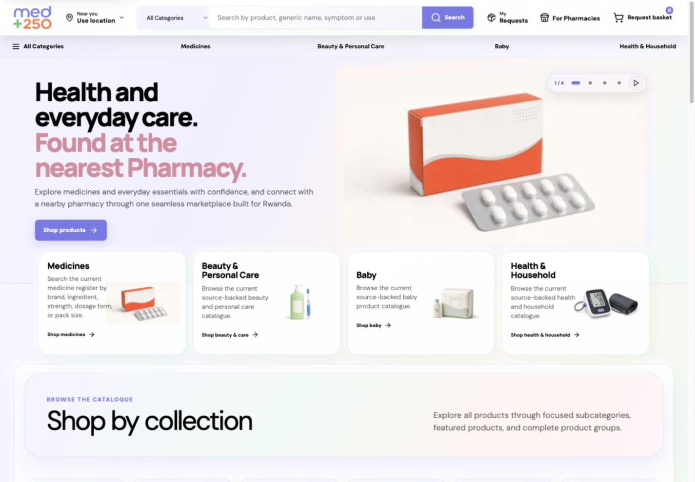
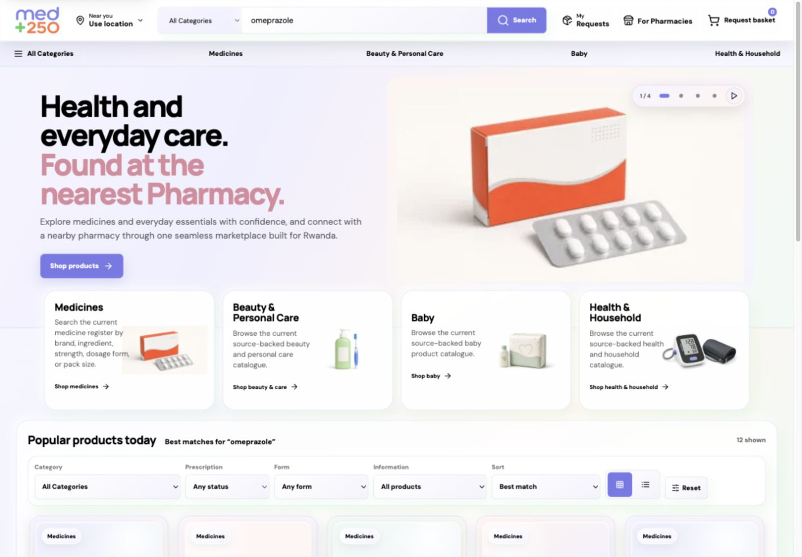
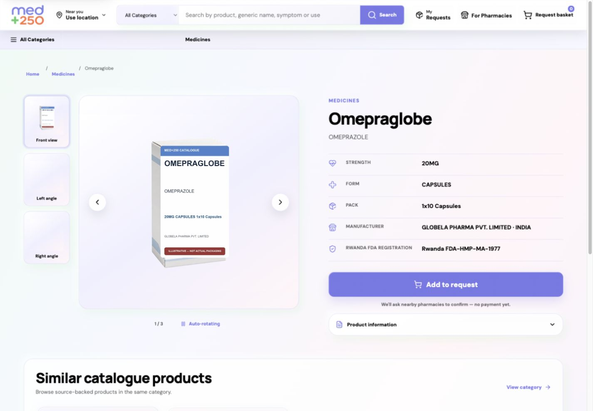
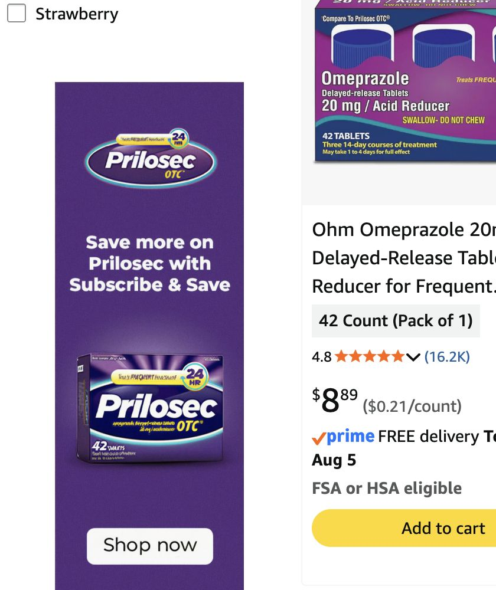

# MED+250 vs Amazon: product, UX, and full-stack audit

**Audit date:** 4 August 2026
**MED+250 release inspected:** `d95fac6003629aafe1ee11ed985c8e2df6e654fa`
**Scope:** Live desktop customer journey, repository architecture, Supabase migrations/functions/policies, Cloudflare Worker configuration, security headers, release verification, and launch evidence. Amazon is assessed only from its publicly observable customer experience; its private code, infrastructure, controls, and operational data were not accessible.

## Executive assessment

MED+250 should not try to look like Amazon. Its calm visual system, restrained interface, Rwanda-specific pharmacy model, product-registration metadata, and request-before-payment explanation are better suited to a healthcare marketplace. The opportunity is to adopt Amazon's **decision support and transactional certainty** without adopting its clutter, advertising pressure, or visual density.

MED+250 is currently a credible pharmacy discovery and multi-pharmacy request product, but not yet an Amazon-class commerce experience. Its main weakness is not styling; it is missing or delayed information at the moment a customer must decide: real packaging, availability confidence, response time, price/price range, delivery or pickup options, and visible request status.

The codebase has a notably stronger production foundation than the current storefront communicates: explicit RLS policies, realtime subscriptions with polling fallback, a WhatsApp outbox and delivery-status webhook, Cloudflare security headers, release-revision verification, data validation, and many launch checks. However, the repository's own readiness report still says `productionReady: false`, primarily because physical UAT is incomplete. Several other evidence gates are stale or awaiting approval even where the implementation is machine-verified.

## Overall comparison

| Dimension | MED+250 | Amazon | Assessment |
|---|---:|---:|---|
| Visual coherence and healthcare tone | 8/10 | 6/10 | MED+250 is calmer and more coherent; Amazon is dense and promotion-led. |
| Search-to-results efficiency | 5/10 | 9/10 | MED+250 keeps a large hero and department area above search results; Amazon puts results and decision tools immediately in view. |
| Product decision support | 4/10 | 10/10 | MED+250 lacks price, stock, delivery/pickup promise, reviews, and pharmacy-response confidence before a request. |
| Trust and safety communication | 8/10 | 7/10 | MED+250 clearly identifies illustrative packaging, source-backed fields, registration data, and no-payment-yet behavior. |
| Transaction certainty | 5/10 | 10/10 | Amazon makes seller, stock, delivery, returns, price, and purchase state explicit. MED+250 defers most certainty until pharmacies reply. |
| Interface simplicity | 8/10 | 4/10 | MED+250 is much easier to scan. Amazon's advertising and option density impose significant cognitive load. |
| Accessibility surface | 7/10 | 6/10 | MED+250 has good landmarks, labels, a skip link, motion controls, and reduced-motion handling. Formal WCAG testing is still required. |
| Observable frontend complexity | Low/moderate | Very high | Matched search pages contained 639 DOM nodes and 12 scripts for MED+250 versus 10,142 nodes and 133 scripts for Amazon. This is complexity evidence, not a speed benchmark. |
| Marketplace capability maturity | 6/10 | 10/10 | MED+250 has the right marketplace primitives, but Amazon's public flow exposes much richer fulfilment and confidence signals. |
| Internal engineering auditability | Strong | Not available | MED+250's repository and controls were reviewed. Amazon's private full stack cannot be responsibly scored from the public site. |

## Journey audit

### 1. Homepage — healthy visual foundation, utility starts too low

What works:

- The visual language is distinctive, calm, and appropriate for health and personal care.
- The headline and department cards explain the service quickly.
- Location, search, customer requests, pharmacy access, and request basket are exposed in the global header.
- The page uses semantic landmarks, headings, and labeled controls.

What limits conversion:

- The first viewport is mostly brand and department discovery. Products, availability, and pharmacy network proof appear too late.
- The hero artwork is generic and explicitly illustrative. It supports mood, but not product recognition or purchase confidence.
- Large vertical spacing makes the experience feel slower even when the code is not slow.
- The location control should communicate its value more explicitly: distance, service radius, and whether permission is currently active.

Recommendation: keep the calm hero but reduce its height by roughly one third on desktop, bring live product or pharmacy-response proof into the first viewport, and expose a plain-language location state such as “Using Kigali location · change”.

### 2. Search — needs restructuring

This is the most important customer-experience defect. Searching for “omeprazole” updates the URL and produces relevant results and filters, but the full hero and department area remain above the results. A customer who has declared intent should not have to pass through the landing-page story again.

Recommended behavior:

1. Collapse the hero and department cards as soon as a search query or filter is active.
2. Put the query, result count, active filters, location state, and sort control directly under the header.
3. Add compact filter chips and a mobile filter sheet; preserve the fuller left rail for larger screens.
4. Give every card actionable confidence: image provenance, nearby pharmacy count or coverage, expected response time, prescription status, and an indicative price or a clear explanation when price is unavailable.
5. Preserve the existing “Add to request” model, but preview what happens next: “Sent securely to up to 10 nearby pharmacies; typical response in X minutes.”

### 3. Product detail — strong safety framing, weak commerce completeness

What works:

- Breadcrumbs, strength, dosage form, pack size, manufacturer, and Rwanda FDA registration give the page useful structure.
- “Illustrative — not actual packaging” is unusually honest and prevents a misleading representation.
- The primary request action and “no payment yet” explanation fit the marketplace model.
- Similar products and medical-disclaimer language are present.

What is missing at decision time:

- Actual approved pack photography or a stronger visual-verification path.
- Nearby availability/coverage and the number of eligible pharmacies.
- Expected pharmacy response time and current realtime connection state.
- Delivery/pickup capabilities and timing.
- Price, indicative range, or a direct explanation of how and when prices arrive.
- Fulfilment-quality signals. In this context, verified pharmacy response reliability and fulfilment SLA are more appropriate than unmoderated medical product reviews.

### 4. Amazon comparator — high-function, high-clutter

Amazon exposes nearly every commercial decision variable on the result card: product image, pack/variant, rating volume, price, discount, delivery date, membership benefit, eligibility, and a direct add-to-cart action. It also uses sponsored placements, large numbers of links, promotional language, personalization, and repeated purchase nudges.

The useful lesson is **information completeness and state visibility**, not visual imitation. MED+250 should remain calmer and more medically responsible while making availability, response, price, and fulfilment states as legible as Amazon makes stock, delivery, and purchase state.

## Information architecture and interaction design

### Strong foundations

- The principal audiences—customers and pharmacies—are separated clearly.
- “Request basket” differentiates this marketplace from an ordinary cart.
- Categories and subcategories create a browse path that does not depend entirely on search.
- Source-backed medicine metadata supports trust better than generic merchandising copy.
- Motion has visible controls and code-level reduced-motion handling.

### Critical UX issues

1. **Intent is not reflected in layout.** Search results inherit the landing-page hierarchy instead of switching to a task-focused mode.
2. **The system's work is mostly invisible.** Dispatch to nearby pharmacies, realtime listening, polling fallback, WhatsApp attempts, and offer arrival exist in the stack but are not translated into an understandable customer status timeline.
3. **Product cards describe, but do not resolve.** They contain medicine metadata but little information about whether the customer can obtain the product, when, where, or for how much.
4. **Illustration is overused where verification matters.** The honesty label is good, but real approved imagery should be the default for products that can be transacted.
5. **The page rhythm is oversized.** Large cards, generous spacing, and tall bands weaken information scent and increase scrolling.
6. **Low-contrast secondary copy needs measurement.** Pale lavender/gray text may fail on some gradient backgrounds. This requires automated and manual contrast testing before a compliance claim.

## Frontend and performance audit

### Architecture

- Next.js 16 / React 19 application compiled through Vinext/Vite and deployed on Cloudflare Workers.
- Supabase JavaScript client for database, Auth, Realtime, and Edge Functions.
- Strong separation of catalogue/search, marketplace request flow, pharmacy portal, and operational verification scripts.
- Responsive CSS, semantic landmarks, skip navigation, control labels, and reduced-motion support were present in the inspected flow.

### Bundle and surface evidence

The repository performance budget passed at the audited revision:

- JavaScript: 804,914 bytes raw / 235,897 bytes estimated transfer.
- CSS: 201,842 bytes raw / 33,681 bytes estimated transfer.
- Marketplace JavaScript: 448,584 bytes raw / 121,736 bytes estimated transfer.
- Initial visual assets: 73,183 bytes.
- Optimized marketplace images detected: 10.

On matched search states, MED+250 exposed 639 DOM nodes, 12 scripts, 22 images, 40 links, 28 buttons, and no iframes. Amazon exposed 10,142 nodes, 133 scripts, 104 images, 700 links, 644 inputs, and 2 iframes. These counts show that MED+250 starts from a far simpler and more maintainable interaction surface; they do not prove better Core Web Vitals.

A single synthetic request to MED+250 returned HTTP 200 with approximately 0.83-second TTFB and 8.88-second total transfer time. Because this was one `curl` sample against a streaming application—not a controlled browser trace—it should trigger deeper measurement, not be treated as a final performance score. Capture LCP, INP, CLS, TTFB, and route transition timings from real users and a repeatable lab profile.

### Frontend priorities

- Route/search-state code-split the landing hero so it is not rendered in active-result mode.
- Reduce the roughly 202 KB raw CSS payload by removing unused/global styles and separating portal/admin styles from the public catalogue.
- Audit the 449 KB raw marketplace path for optional libraries, duplicate utilities, and eagerly loaded components.
- Use responsive `srcset`/sizes and lazy loading for below-fold imagery; preload only the real LCP asset.
- Reserve media dimensions to avoid layout shifts and use skeletons only where data is genuinely asynchronous.
- Add field performance telemetry segmented by route, device, connection class, and authenticated state.

## Backend, Realtime, WhatsApp, and data audit

### Supabase strengths

- The repository contains 89 migrations and explicit RLS enablement/policies for marketplace tables.
- Realtime publication includes orders, pharmacy notifications, offers, and related marketplace tables.
- Customer offer subscriptions listen for offer and order changes, refresh on successful subscription, report channel errors, and poll every 15 seconds as a fallback.
- Pharmacy notifications subscribe by pharmacy ID and trigger portal refreshes.
- Marketplace functions validate authenticated ownership/participation, and security-definer functions generally pin an empty `search_path`.
- Recent migrations harden private trigger privileges and cap eligible pharmacy dispatch to the nearest 10 recipients.
- Database grants are explicit, which aligns with Supabase's current move away from automatically exposing new tables to the Data API.

Supabase requires tables to be in the Realtime publication and applies RLS to Postgres Changes; the inspected implementation covers both mechanisms. See [Supabase Postgres Changes](https://supabase.com/docs/guides/realtime/postgres-changes) and [Row Level Security](https://supabase.com/docs/guides/database/postgres/row-level-security).

### WhatsApp strengths

- A dispatch Edge Function claims outbox batches, sends Meta templates, and records success/retry state.
- The webhook validates a Web Crypto HMAC signature, enforces a payload-size limit, and records sent, delivered, read, and failed states.
- Dispatch eligibility is separated from pharmacy portal-login authority.

### Backend risks and improvements

1. **End-to-end observability is incomplete.** Add one correlation ID across customer request, order row, recipient selection, realtime event, outbox item, Meta message ID, webhook status, pharmacy response, and customer offer display.
2. **Sequential WhatsApp dispatch limits throughput.** This implementation slice replaces it with bounded concurrency while preserving the existing idempotent claim and retry boundaries; provider-volume testing remains required.
3. **Manual pharmacy tokens in `localStorage` increase XSS impact.** This implementation slice removes manual refresh calls and persistent pharmacy-token writes, delegates rotation to Supabase Auth, and scopes pharmacy sessions to `sessionStorage`. An httpOnly server-session boundary and CSP nonce/hash migration remain stronger future options.
4. **Realtime should expose connection health.** Keep the polling fallback, but instrument subscription setup, channel errors, event latency, fallback activation, and duplicate-event suppression.
5. **Production synthetic testing is needed.** Run a scheduled, non-medical test request through ten controlled pharmacies, verify database recipients, Realtime, WhatsApp send/delivery statuses, pharmacy response, and customer receipt, then clean up test data safely.
6. **Retention needs enforcement evidence.** Prescription retention is still awaiting approval in the readiness ledger. Translate the approved period into storage lifecycle, row deletion/anonymization, backup handling, and audit evidence.

## Cloudflare, deployment, and security audit

### Strengths

- The Worker sets CSP, HSTS, COOP, CORP, X-Frame-Options, Referrer-Policy, Permissions-Policy, request IDs, `Server-Timing`, and release revision headers.
- Production logs and request correlation are enabled.
- Live route verification passed ten routes at the exact audited release revision.
- Turnstile is represented in implementation/readiness evidence.

### Risks

- Mutable Worker environment state has been replaced with request-scoped `AsyncLocalStorage`; production bindings are generated by Wrangler and consumed through `Cloudflare.Env`.
- Production traces are enabled at a 5% head-sampling rate. A release-bound trace sample and operation-level backend spans remain required.
- CSP allows `unsafe-inline` for scripts and styles. Move toward nonces/hashes and remove the allowance where framework and Turnstile constraints permit.
- Account/domain evidence is stale or absent in the readiness ledger even though the deployed site is reachable. Regenerate dated evidence from the currently deployed account and DNS zone.

These changes align with current [Cloudflare Workers best practices](https://developers.cloudflare.com/workers/best-practices/workers-best-practices/) and [Workers observability guidance](https://developers.cloudflare.com/workers/observability/).

## Go-live readiness

At the audited revision, the repository's own readiness reporter returned:

- `productionReady: false`
- `siteProductionReady: false`
- `marketplaceTransactionReady: false`
- 1 confirmed gate and 10 pending gates
- Physical UAT: 8 passed, 4 pending

The remaining transaction blocker is the physical UAT gate: signed approval/test evidence is missing. Some other pending entries are non-blocking follow-ups, machine-verified implementations, superseded items, or stale evidence, but the ledger must be reconciled so operational truth and automated readiness agree.

Before presenting the system as fully transaction-ready:

1. Complete the four physical UAT scenarios with named tester, device/browser, date, evidence, outcome, and sign-off.
2. Run and preserve an end-to-end production synthetic request covering database dispatch, Realtime, polling fallback, WhatsApp delivery receipt, pharmacy response, and customer display.
3. Refresh Cloudflare account, DNS, edge-function, security-hardening, and domain evidence at the deployed revision.
4. Approve and encode Auth rate limits and prescription retention.
5. Resolve or formally accept the 51 duplicate-register review items and the remaining hidden product descriptions.
6. Make the readiness report fail only for genuine blockers; classify machine-verified and historical/superseded gates accurately.

## Prioritized remediation roadmap

### P0 — customer trust and transaction correctness

1. Collapse the homepage hero/category bands whenever search or filters are active.
2. Add a request-status timeline: submitted, locating pharmacies, sent to X pharmacies, WhatsApp delivery state, offers received, last updated, and fallback/retry state.
3. Complete physical UAT and the controlled production synthetic request.
4. Show pharmacy coverage, expected response time, prescription requirement, and delivery/pickup capability before request submission.
5. Add end-to-end correlation and alerts for zero-recipient dispatch, no WhatsApp delivery, no offer propagation, elevated Realtime fallback, and slow response latency.

### P1 — decision quality, reliability, and security

1. Replace illustrative product media with approved real pack photography where rights/provenance are verified; retain a clear fallback label.
2. Expose price or price-range behavior honestly, including when prices are supplied only after pharmacy response.
3. Tighten card density, active filters, and search-result hierarchy.
4. Move pharmacy session secrets away from manually managed `localStorage` and strengthen CSP.
5. Refactor Worker environment handling, generate binding types, and enable sampled traces.
6. Make WhatsApp dispatch concurrent within provider-safe limits and publish queue depth, retry count, and webhook-latency metrics.

### P2 — differentiation and scale

1. Add verified fulfilment signals: pharmacy response rate, median response time, delivery SLA, and cancellation reliability.
2. Add Kinyarwanda/French localization and test healthcare terminology with users.
3. Create a low-bandwidth mode and resilient request-resume behavior for intermittent connectivity.
4. Add privacy-respecting personalization based on location and previous requests, with clear controls.
5. Instrument the complete funnel: search, detail, request add, submission, dispatch, first pharmacy response, offer selection, fulfilment, and support outcome.

## Recommended product principle

**Amazon-level certainty, MED+250-level calm.**

The target experience is not a smaller Amazon. It is a trustworthy healthcare request system where every state is explicit, every claim has provenance, and the customer always knows what the system is doing, who has received the request, what happens next, and how long it should take.

## Audit limitations

- No order or prescription was submitted and no personal/medical data was created.
- Amazon's private source, APIs, databases, security controls, operations, and service architecture were not accessible; full-stack comparisons to Amazon are therefore capability-level, not code-level.
- No controlled Chrome performance trace or real-user Core Web Vitals dataset was available during this audit.
- Accessibility findings are an expert surface review, not a WCAG conformance certification.
- Amazon screenshots containing signed-in personal information were retained locally as raw evidence but intentionally excluded from this report; only a privacy-safe crop is shown.
